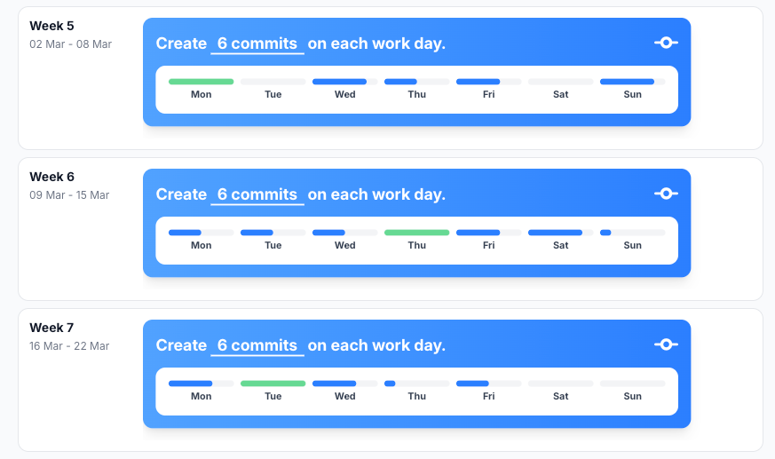

# Commits

## Reflection

I think that creating commits this sprint went very well overall. I was consistent in committing my work and made sure
that important changes were saved properly. However, I noticed that my commits were often quite large and contained
multiple changes at once. This makes it harder to track what exactly was changed and why.

For future sprints, I want to improve this by creating smaller, more focused commits. This will make my workflow
clearer, both for myself and for others who might look at the repository. Additionally, it will make debugging easier,
since it becomes simpler to trace back when a specific issue was introduced.

## Development Plan

For the next sprint, I want to focus on making clearer and more structured commits. As soon as a specific part of
functionality works, I will immediately create a commit with a clear and descriptive message.

By doing this, each commit will represent a small, logical step in the development process. This not only improves
readability of the commit history, but also creates reliable fallback points in case something breaks. Instead of losing
a large amount of work, I can easily revert to a stable version.

My goal is not only to increase the number of commits (for example aiming for around 6 commits a day), but more
importantly to improve the quality and clarity of each commit.