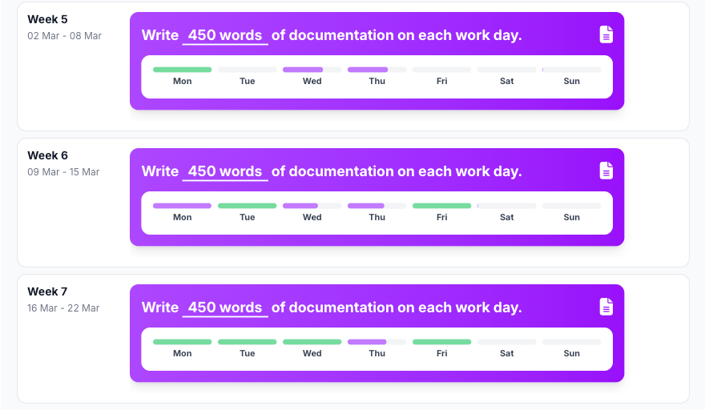

# Documentation written

## Reflection

Writing documentation also went quite well this sprint. After finishing a task or implementing a piece of functionality,
I made sure to update the documentation immediately so that everything stays up to date. This helped me maintain a clear
overview of the system and ensured that the project remained understandable.

However, I mainly wrote the documentation from my own perspective. This means it might be clear for me, but not
necessarily for others who were less involved in that specific part of the project.

## Development Plan

For the next sprint, I want to involve more of my teammates in the documentation process. I will actively ask for
feedback to check if the documentation is clear and understandable for everyone, not just for myself.

Additionally, I want to focus on writing documentation in a more structured and standardized way. This includes using
clear headings, consistent terminology, and possibly adding small explanations or examples where needed.

By doing this, I aim to improve the overall quality and usability of the documentation, making it a more valuable
resource for the entire team.