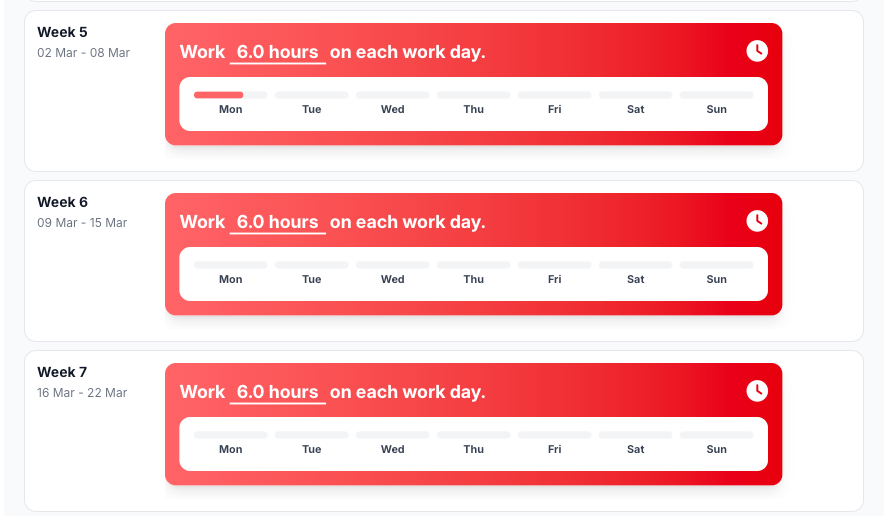

# Hours spend

## Reflection

For this criteria, I did not perform well this sprint. I often forgot to check in, and even when I did check in, I
sometimes forgot to check out. As a result, my logged hours are incomplete and do not accurately reflect the work I have
done.

This made it difficult to track my actual time investment and reduced the transparency of my contribution to the
project. Keeping accurate hours is important, not only for myself but also for the team and for assessment purposes.

## Development Plan

For sprint 2, I will actively and consistently keep track of my hours. I want to turn this into a habit so that my work
is clearly visible and properly documented.

To achieve this, I will:

Set reminders at the start and end of my work sessions
Make checking in and out part of my standard workflow
Review my logged hours at the end of each day

By doing this, I aim to improve both my discipline and the reliability of my time tracking, so that it accurately
represents the effort I put into my school work.