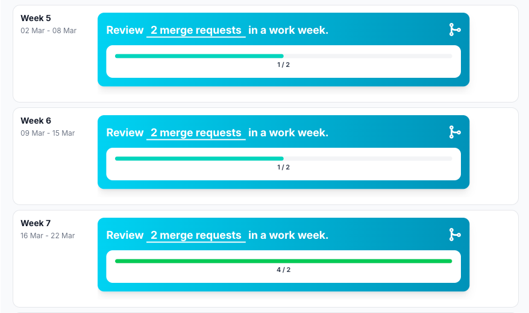

# Merge requests reviewed

## Reflection

Reviewing merge requests also went well this sprint. The other backend developer and I communicated effectively,
reviewed each other’s work, and provided feedback where necessary. This helped us maintain the quality of our code and
ensured that we both understood the changes being made.

Through these reviews, we were able to catch potential issues early and align on coding standards and implementation
choices. This made our collaboration stronger and improved the overall reliability of the backend.

However, this process was mainly limited to the backend work. As a result, I do not have a clear overview of what the
rest of the team has been working on.

## Development Plan

For the next sprint, I want to involve the rest of the team more in the merge request process. If I’m being honest, I
currently don’t have a clear understanding of what other team members have been working on or what they have built.

To improve this, I will:

Encourage all team members to create merge requests for their work
Actively review merge requests outside of just the backend
Ask questions when something is unclear to better understand their contributions

By doing this, I aim to increase team alignment, improve collaboration, and gain a better overview of the entire project
instead of just my own area.
