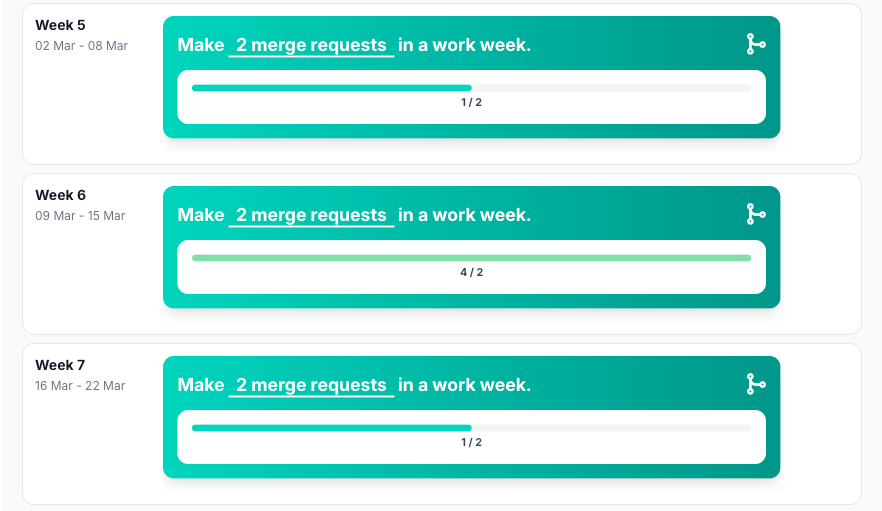

# Merge requests made

## Reflection

Creating merge requests also went well this sprint. I consistently created merge requests for my work and received
useful feedback from the other backend developer. I made sure to review this feedback carefully and implemented the
suggested improvements where necessary.

This process helped improve the quality of my code and ensured that my changes aligned with our agreed standards. It
also reinforced good collaboration within the backend part of the team.

However, I noticed that some of my merge requests were quite broad and sometimes covered multiple user stories. This
made them less clear and slightly harder to review.

## Development Plan

For the next sprint, I want to create clearer and more focused merge requests. Each merge request should ideally be
linked to a single user story, so that the scope is well-defined and easy to understand.

To achieve this, I will:

Break down my work into smaller, manageable tasks
Create a separate branch per user story
Ensure each merge request has a clear description and context

By doing this, I aim to improve the readability, reviewability, and overall quality of my merge requests, making
collaboration within the team more efficient.

