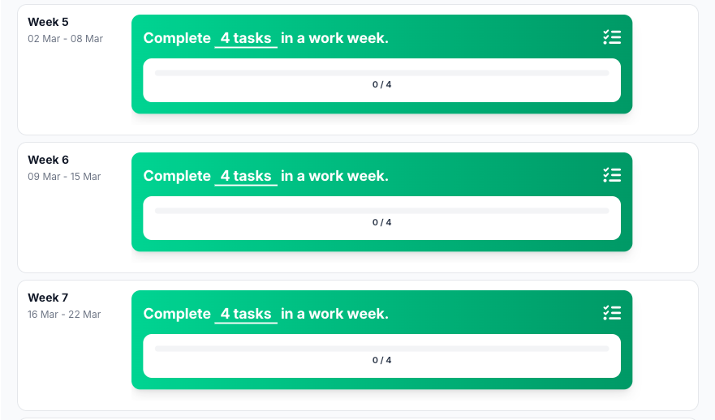
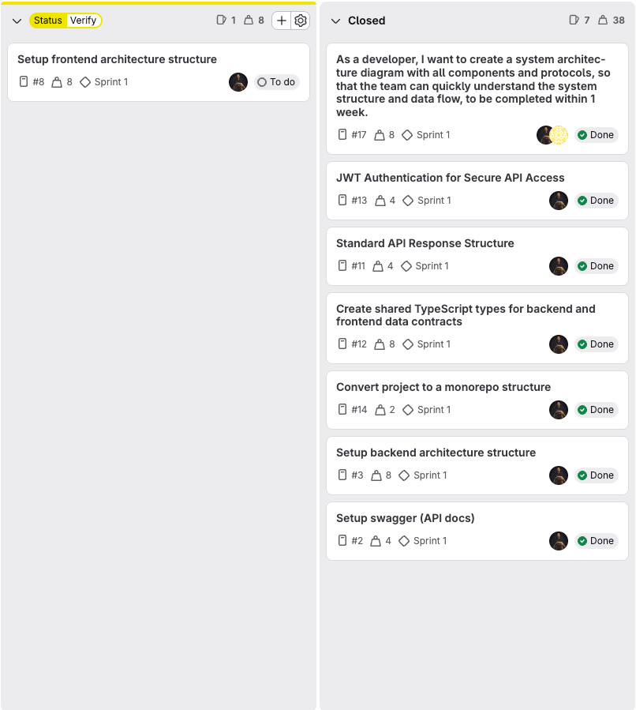

# Task completed

(It doesn't work)

## Reflection

I think the tasks also went well this sprint. I created useful tasks that focused on setting up the basic structure of
our project. This was important to create a solid foundation for further development.

However, most of my tasks were related to setup and initial configuration rather than actual client-facing
functionality. While this was necessary at the start, it means that less visible progress was made from a user
perspective.

## Development Plan

For the next sprint, I want to focus more on client-facing functionality instead of mainly setup tasks. I want to create
tasks that contribute more directly to the end product and deliver visible value.

In my defence, during this sprint it was not yet very clear what we were building, which made it logical to focus on
setup first. Now that the project direction is clearer in sprint 2, I can shift my focus towards more concrete features.

By doing this, I aim to create a better balance between technical setup and functional development, and contribute more
directly to the final product.