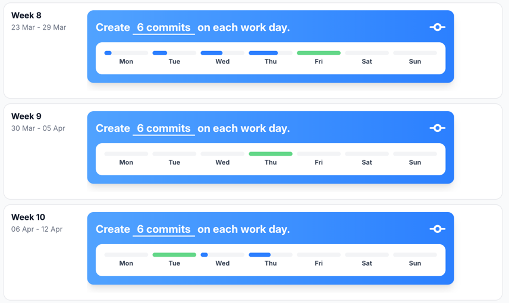
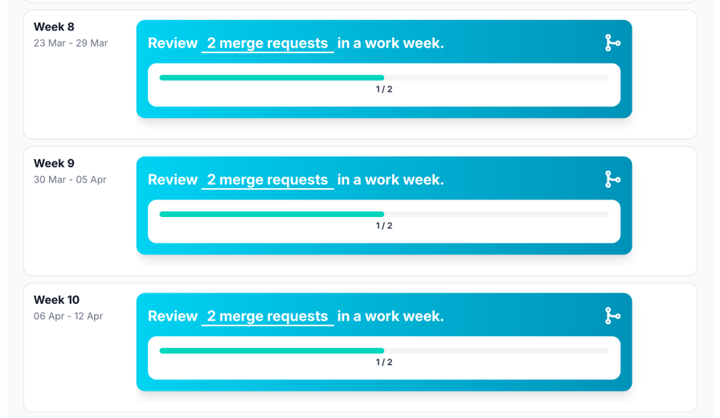
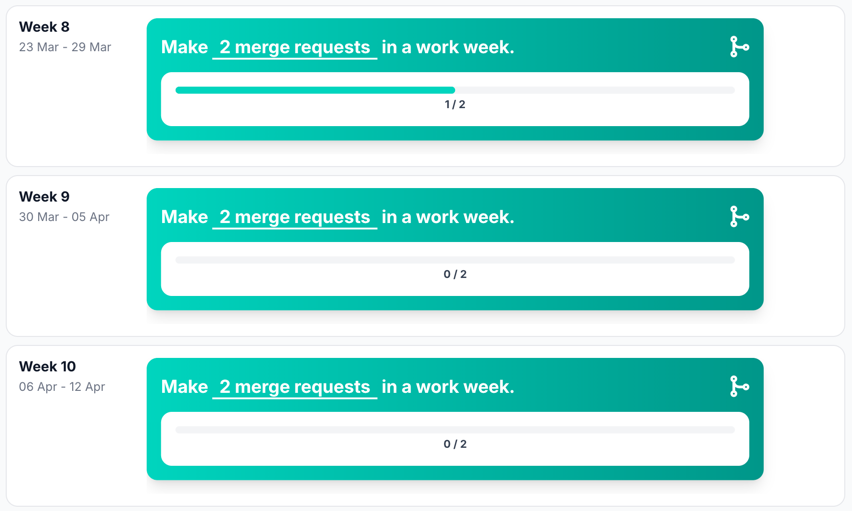
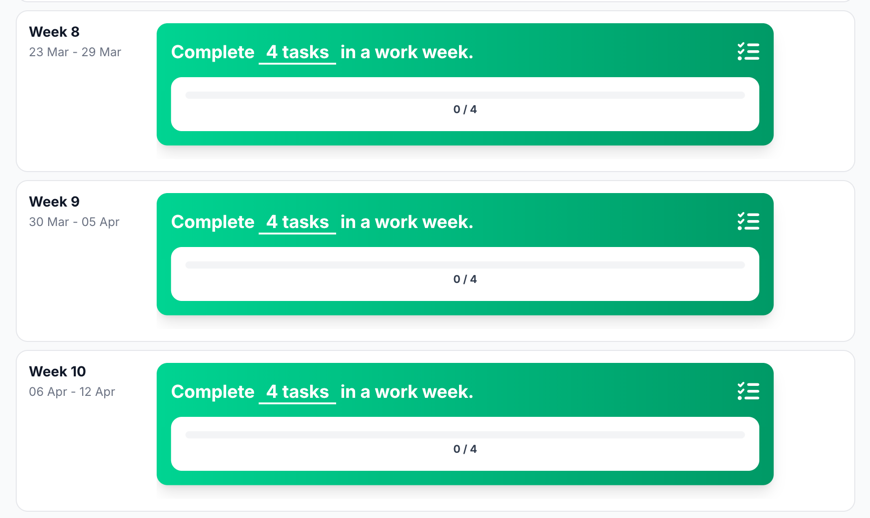
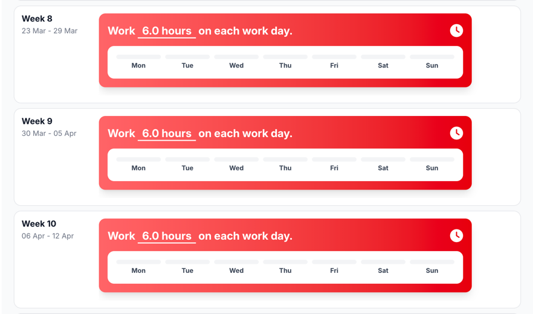
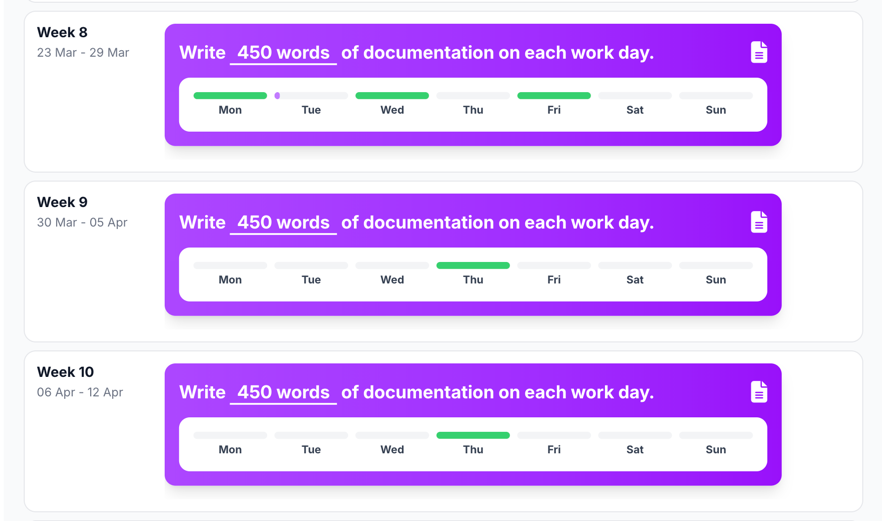

# Commits

## Reflection

This sprint I think I did a good job of committing to GitLab.
But statistics show that I should be commiting more often and
should make smaller commits.

## Development Plan

For the next sprint I will try to commit more often and make
smaller commits.

# Merge requests reviewed

## Reflection

I think I didn't do a great job of reviewing merge requests.
I did review some, but I should have reviewed more merge requests.

## Development Plan

For the next sprint I will try to review more merge requests
by staying on top of the issues with my teammates

# Merge requests made

## Reflection

The statistics show that I did not make a lot of merge requests.
But that is incorrect. I made more than one merge request.
Something must have gone wrong.

## Development Plan

This sprint I will check my merge requests and make sure that it is
updated in the statistics.

# Tasks completed

## Reflection

The statistics for tasks are also incorrect. But I heard from
my classmate that I didn't finish a task on gitlab the right way.

## Development Plan

For the next sprint I will make sure that I finish tasks on gitlab
the right way.

# Work hours

## Reflection

The work hours are again low. I do check in, but I keep forgetting to check out.

## Development Plan

For the next sprint I will make sure that I check out more.
I am going to set an alarm to check out every time I am done.

# Words written

## Reflection

I think this went also well, but should I commit more to
spread it more through the week

## Development Plan

Everytime I am done with a piece of a task, I will commit to GitLab.

