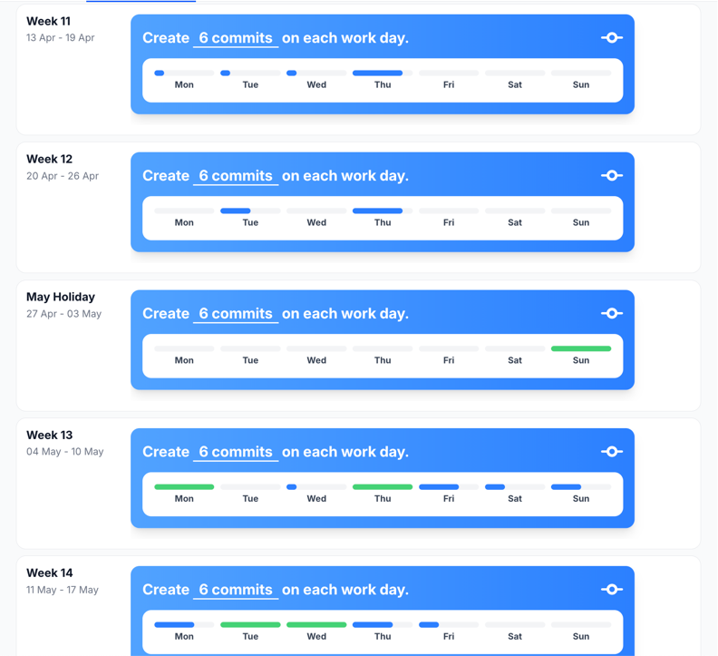
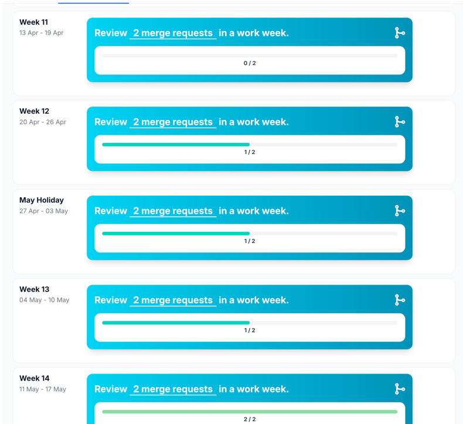
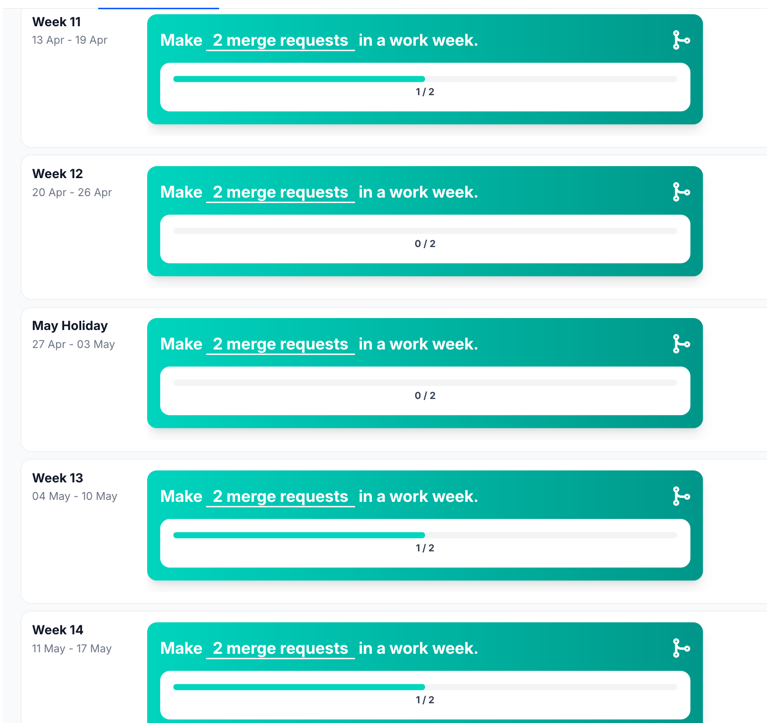
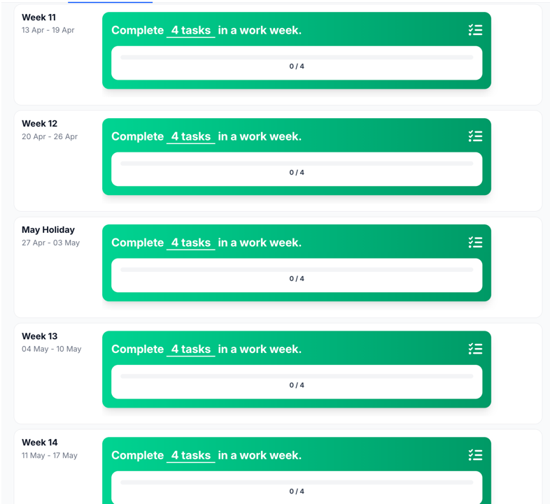
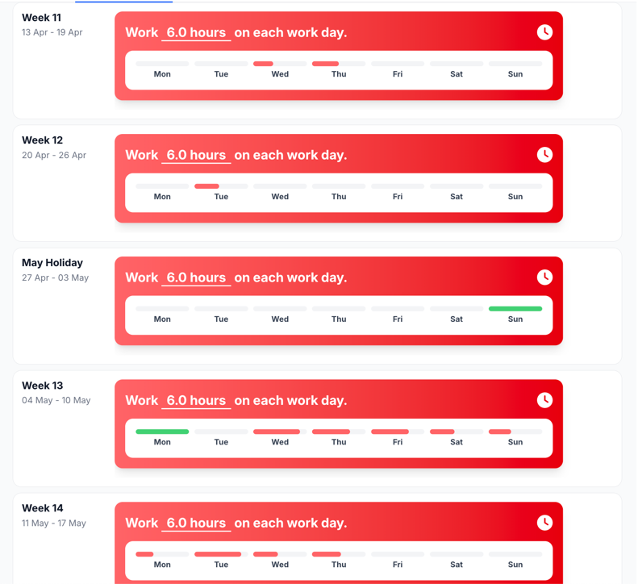
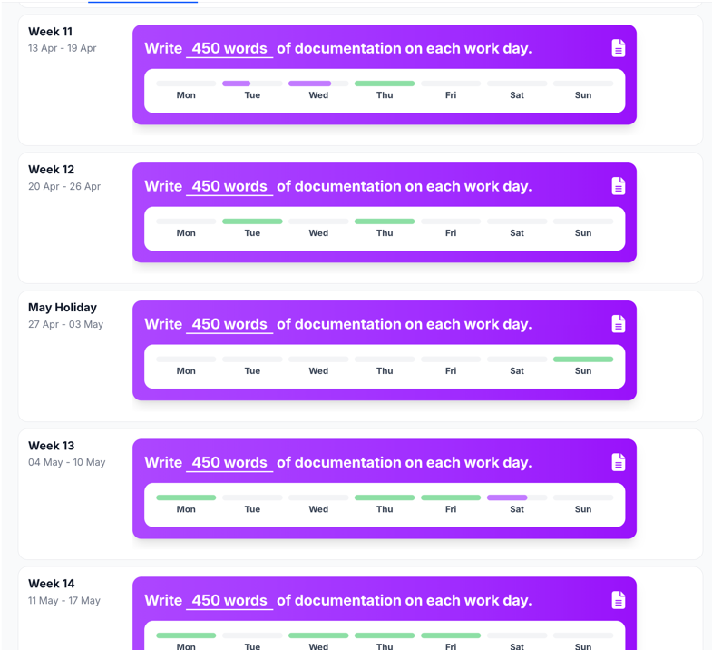

# Commits

## Reflection

This sprint I think I did a much better job with committing to GitLab.
Compared to the previous sprint, I committed more often and tried to make smaller and more focused commits instead of
large commits at once.

I also became more aware of when I should commit during development, which helped me keep my work more organized and
easier to review for teammates.

## Development Plan

For the next sprint I want to continue this improvement by committing consistently throughout the week and making sure
every commit has a clear purpose and message.

# Merge requests reviewed

## Reflection

This sprint I improved a lot in reviewing merge requests.
I reviewed more merge requests from teammates and paid more attention to the code quality and functionality before
approving changes.

By reviewing more often, I also gained a better understanding of the overall project and the work my teammates were
doing.

## Development Plan

For the next sprint I want to continue reviewing merge requests regularly and provide more detailed feedback where
possible.

# Merge requests made

## Reflection

This sprint went much better regarding merge requests.
I created more merge requests and made sure my work was properly linked and visible in GitLab statistics.

I also improved the structure of my merge requests by keeping them smaller and easier to review.

## Development Plan

For the next sprint I want to continue making clean and organized merge requests with clear descriptions and linked
issues.

# Tasks completed

## Reflection

The statistics for completed tasks are still lower than expected.
This sprint I forgot to complete some tasks in GitLab using the correct workflow, which caused the statistics to be
inaccurate.

Even though I finished the work itself, not all tasks were properly updated or closed in GitLab.

## Development Plan

For the next sprint I will make sure that I complete and close tasks in GitLab using the correct process so the
statistics accurately reflect the work I completed.

# Work hours

## Reflection

This sprint the work hours were tracked much better.
I became more consistent with checking in and checking out, which made the statistics more accurate.

Setting reminders helped me remember to properly register my hours at the end of the day.

## Development Plan

For the next sprint I want to maintain this consistency and improve my time tracking even further.

# Words written

## Reflection

This sprint I spread my work better throughout the week.
I wrote documentation and reports more consistently instead of doing everything at the last moment.

Because I committed more frequently, the written work was also distributed more evenly across the sprint.

## Development Plan

For the next sprint I want to continue documenting my work consistently and combine this with frequent commits to
GitLab.

