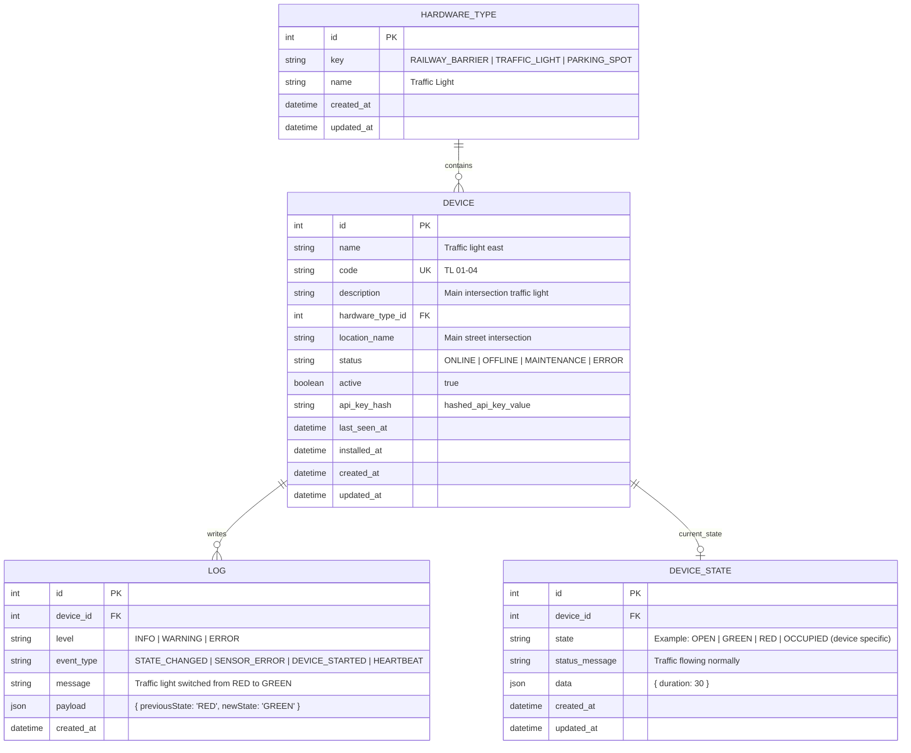

# Raspberry PI Deployment - Design

- **Written by:** Gavin Tjin, software engineer
- **Date:** 07-05-2026
- **Classifications:** Public
- **Version:** 2.1
- **Target audience:** Backend and embedded engineers
- **Keywords:** ERD, Database design, Smart City, IoT, NestJS
- **Client:** Gerald Stap (mayor)
- **Company:** Smart Heaven

# Table of contents

1. Introduction
2. Hardware type design
    - 2.1 Introduction
    - 2.2 Purpose of hardware categorisation
    - 2.3 Design considerations
    - 2.4 Limitations
    - 2.5 Partial conclusion
3. Device design
    - 3.1 Introduction
    - 3.2 Device identification and management
    - 3.3 Authentication design
    - 3.4 Design considerations
    - 3.5 Partial conclusion
4. Device state design
    - 4.1 Introduction
    - 4.2 Separation of metadata and runtime state
    - 4.3 Flexible state structure
    - 4.4 Limitations
    - 4.5 Partial conclusion
5. Log design
    - 5.1 Introduction
    - 5.2 Event logging structure
    - 5.3 Log levels and event types
    - 5.4 Limitations
    - 5.5 Partial conclusion
6. Relationship design
    - 6.1 Introduction
    - 6.2 Hardware type and device relationship
    - 6.3 Device and log relationship
    - 6.4 Device and device state relationship
    - 6.5 Partial conclusion
7. Conclusion
8. Entity Relationship Diagram (ERD)
9. Recommendations
10. References

# 1. Introduction

This document describes the design decisions behind the Entity Relationship Diagram (ERD) used for the Smart Heaven
Smart City API.

The API is intended to process and store information from embedded devices such as railway barriers, traffic
lights, and parking sensors. Because Smart City environments involve continuous device communication, frequent runtime
state updates, and growing amounts of historical log data, the database structure must remain scalable, maintainable,
and efficient while supporting future hardware expansions.

This document is aimed at backend and embedded engineers responsible for developing and integrating smart city devices
with the backend API.

The following main question is central within this design research:

**Why is the chosen database structure the most suitable design for storing Smart City devices, device information,
device states, historical logs, and their relationships in a scalable and maintainable way?**

To answer this question, the following subquestions are defined:

- Why should different types of Smart City devices be categorised using a dedicated hardware type entity?
- Why should device identification and authentication be handled at the device level rather than within other entities?
- Why should runtime device state information be stored separately from static device metadata?
- Why should logs and historical events be stored in a dedicated entity rather than within the device or state entities?
- Why are the chosen relationships between hardware types, devices, device states, and logs the most suitable design for
  this API?

This document first explores the hardware categorisation structure, followed by the design of devices, states, logs,
and entity relationships.

# 2. Hardware type design

## 2.1 Introduction

This chapter explains the design decisions behind the `HARDWARE_TYPE` entity and why hardware categorisation is
necessary within the Smart City API.

## 2.2 Purpose of hardware categorisation

The Smart Heaven API must support multiple types of embedded devices, such as railway barriers, traffic lights,
and parking sensors. Because new hardware types may be added in the future, a generic categorisation structure is
required.

Without a separate hardware type entity, hardware-specific information would need to be duplicated across every
device record. This would make the database harder to maintain and scale, because any change to a hardware
category would require updates across all related device records (GeeksforGeeks, 2026).

## 2.3 Design considerations

The `HARDWARE_TYPE` entity contains only generic information shared across similar devices.

### Fields

- `key` — Used internally by the backend as a unique system identifier. Keeping a separate internal key ensures that
  display names can change without affecting backend logic.

- `name` — Human-readable name intended for dashboards or management interfaces. Separating this from the internal key
  allows the display name to be updated without breaking communication between services.

This separation between internal identifiers and display names improves maintainability and flexibility. (What is
seperation of concerns?, n.d.)

## 2.4 Limitations

The `HARDWARE_TYPE` entity only stores generic classification information. Hardware-specific behaviour (e.g. OPEN,
CLOSED, etc) is intentionally
not stored in this entity because different devices may require different runtime states and configurations. Storing
hardware-specific logic here would reduce flexibility and make the design less scalable.

## 2.5 Partial conclusion

A dedicated `HARDWARE_TYPE` entity is the most suitable design choice because it avoids duplication of hardware
category information across devices and allows new hardware categories to be introduced without changing the database
structure.

The entity intentionally stores only generic classification information rather than hardware-specific behaviour,
because different device types may require different runtime states and configurations. Separating these
responsibilities
keeps the API flexible, maintainable, and scalable as the Smart Heaven project expands.

# 3. Device design

## 3.1 Introduction

This chapter explains the design decisions behind the `DEVICE` entity and how physical IoT devices are represented
within the system.

## 3.2 Device identification and management

The `DEVICE` entity represents a physical embedded device connected to the API. Each device requires a unique
identifier so that embedded systems can communicate with the backend consistently.

### Important fields

- `code` — A unique identifier used by embedded devices when communicating with the API (example: `TL-01-04`). A
  dedicated code field is chosen over using the internal database `id` because it allows human-readable and
  hardware-consistent identification without exposing internal identifiers. According to Nairi (2020), exposing
  internal database identifiers can create security and enumeration risks within APIs.

- `status` — Represents the operational state of the device itself (`ONLINE`, `OFFLINE`, `MAINTENANCE`, `ERROR`). This
  is stored at the device level because it reflects the physical availability of the device, not its functional
  behaviour, which is tracked separately in `DEVICE_STATE`.

- `active` — Allows devices to be disabled without removing historical data. This avoids data loss when a device is
  decommissioned and supports historical analysis.

## 3.3 Authentication design

Because embedded devices communicate directly with the API, authentication must be handled at the device level. The
`api_key_hash` field stores a hashed API key rather than a plaintext credential.

This design was chosen because storing raw credentials in the database creates a serious security risk if the database
is ever compromised. According to Dhandala (2026), API keys should be stored securely using hashing or encryption to
reduce the risk of credential exposure. Hashing ensures that even if the database is accessed without authorisation,
credentials cannot be directly reused.

Storing the authentication information within the `DEVICE` entity itself — rather than in a separate authentication
table — was chosen to keep the design simple and to avoid unnecessary joins for a system operating on a resource-limited
Raspberry Pi edge device.

## 3.4 Design considerations

The `DEVICE` entity stores only metadata and operational information related to the physical device itself. Frequently
changing runtime information, such as traffic light states or railway barrier positions, is intentionally stored
separately within the `DEVICE_STATE` entity.

Storing runtime data within the `DEVICE` entity would cause frequent updates to the same record, increasing database
load and making device management data less stable. According to Jamadhiar and Jamadhiar (2025), reducing unnecessary
database operations and separating frequently updated data can improve database performance and maintainability.

## 3.5 Partial conclusion

Handling device identification and authentication at the device level is the most suitable design because it keeps
communication between embedded devices and the backend simple, secure, and efficient without requiring additional
entities or complex joins.

Using a dedicated device code instead of internal database identifiers improves readability and prevents exposure of
internal IDs, while storing hashed API keys improves security if the database is compromised.

# 4. Device state design

## 4.1 Introduction

This chapter explains how runtime device information is stored and why the `DEVICE_STATE` entity is separated from the
`DEVICE` entity.

## 4.2 Separation of metadata and runtime state

Embedded devices continuously change behaviour during operation, for example a traffic light switching between RED and
GREEN, or a parking sensor changing between OCCUPIED and AVAILABLE. Because this information changes frequently,
storing it within the `DEVICE` entity would cause constant updates to static metadata records, increasing database load
and making the design harder to maintain.

According to Jamadhiar and Jamadhiar (2025), separating frequently updated data from more stable records can improve
database performance and maintainability.

By separating runtime state into its own entity, updates to device state do not affect device metadata, and the
`DEVICE` entity remains stable.

## 4.3 Flexible state structure

Different hardware types require different runtime states, such as `OPEN` for a railway barrier or `GREEN` for a
traffic light. Defining a fixed set of states at the database level would require schema changes every time a new
hardware type is introduced.

To avoid this, the `state` field is intentionally kept generic, allowing each device type to use its own relevant
values. Additionally, the `data` JSON field allows hardware-specific properties to be stored dynamically without
modifying the schema.

According to *Towards flexible data schemas* (2024), flexible schema structures improve adaptability by allowing systems
to support changing and evolving data requirements without requiring constant schema redesigns.

Example railway barrier state:

```json
{
  "state": "OPEN",
  "duration": 30,
  "vehicleDetected": false
}
```

Example bridge state:

```json
{
  "state": "OPENING",
  "shipDetected": true
}
```

## 4.4 Limitations

Using a generic JSON structure for the `data` field reduces strict database-level validation, because the structure of
this field can differ between devices.

According to Venzl (2023), combining JSON structures with relational databases improves flexibility, but it also shifts
part of the validation responsibility away from the database schema and towards the application layer.

This means validation must be handled within the backend application itself rather than enforced by the database
schema.

## 4.5 Partial conclusion

Storing runtime state separately from device metadata is the most suitable design because it prevents frequent updates
to static records and keeps the database structure stable and maintainable.

The use of a generic state field and JSON payloads allows the API to support multiple hardware types without
requiring frequent schema changes, improving flexibility and scalability.

However, this flexibility reduces strict database-level validation, which means validation responsibilities must be
handled within the backend application instead of the database schema itself.

# 5. Log design

## 5.1 Introduction

This chapter explains how historical events and system messages are stored within the API and why a dedicated log
entity is necessary.

## 5.2 Event logging structure

The `LOG` entity stores historical events generated by embedded devices, such as state changes, sensor failures,
heartbeat events, and startup events. Storing these events within the `DEVICE` or `DEVICE_STATE` entities would cause
these tables to grow rapidly and would mix operational data with historical records, making both harder to query and
maintain.

A dedicated `LOG` entity keeps historical data separate, so that monitoring and debugging operations do not affect
device management performance. According to GeeksforGeeks (2025), centralised logging structures improve monitoring,
debugging, and maintainability by separating log data from operational system data.

## 5.3 Log levels and event types

The `level` field represents the severity of the event (`INFO`, `WARNING`, `ERROR`). Separating severity from the
event type allows the backend to filter logs by urgency without needing to parse the event description.

The `event_type` field categorises the type of event (`STATE_CHANGED`, `SENSOR_ERROR`, `DEVICE_STARTED`,
`HEARTBEAT`). This makes it possible to filter and analyse specific categories of events independently.

According to Srivastava (2026), structured logging improves log filtering, monitoring, and analysis by storing logs in
a structured and categorised format rather than relying on unstructured log messages alone.

Additional details are stored in the `payload` JSON field. For example:

```json
{
  "previousState": "RED",
  "newState": "GREEN"
}
```

## 5.4 Limitations

Similar to the `data` field in `DEVICE_STATE`, the `payload` JSON field in `LOG` reduces strict database-level
validation. The structure of the payload can differ between event types, so validation must be enforced within the
backend application rather than at the database level.

According to Venzl (2023), JSON fields provide flexibility within relational databases, but they also reduce the level
of strict schema enforcement compared to traditional relational structures.

## 5.5 Partial conclusion

A dedicated `LOG` entity is the most suitable design because it separates historical event data from operational device
records, preventing log growth from affecting device management performance.

The use of structured `level` and `event_type` fields supports efficient filtering and analysis, while JSON payloads
provide the flexibility needed to store event-specific details without requiring schema changes.

However, using flexible JSON payloads reduces strict database-level validation, meaning validation responsibilities
must be handled within the backend application itself.

# 6. Relationship design

## 6.1 Introduction

This chapter explains the relationships between the entities within the ERD and the reasoning behind these design
choices.

## 6.2 Hardware type and device relationship

The relationship between `HARDWARE_TYPE` and `DEVICE` is one-to-many. One hardware type can contain multiple devices,
but each device belongs to exactly one hardware type. According to GeeksforGeeks (2025), one-to-many relationships are
commonly used when a single entity category is associated with multiple dependent records.

This design avoids duplication of hardware category information and ensures that changes to a hardware category
automatically apply to all associated devices.

## 6.3 Device and log relationship

The relationship between `DEVICE` and `LOG` is one-to-many. A single device can generate many log entries over time,
but each log entry belongs to exactly one device.

According to GeeksforGeeks (2025), one-to-many relationships are suitable for structures where a parent entity is
associated with multiple dependent records over time.

This structure was chosen because logs are device-specific and need to be traceable back to the source device for
debugging and historical analysis.

## 6.4 Device and device state relationship

The relationship between `DEVICE` and `DEVICE_STATE` is one-to-zero-or-one. A device may not yet have a state if it
has never reported one, so a strict one-to-one relationship would be incorrect.

The foreign key is stored in `DEVICE_STATE` rather than in `DEVICE` because the state depends on the existence of the
device, not the other way around. A uniqueness constraint on `device_id` ensures that each device has at most one
active runtime state record.

This design also allows future scalability if historical state tracking is introduced, as the uniqueness constraint
could be relaxed to support multiple state records per device over time.

## 6.5 Partial conclusion

The chosen relationships are the most suitable design because they reflect the actual dependencies between entities
while avoiding unnecessary complexity.

Using one-to-many relationships for hardware types and logs prevents duplication and supports efficient historical
tracking, while the one-to-zero-or-one relationship between `DEVICE` and `DEVICE_STATE` correctly reflects that a
device may not yet have reported a runtime state.

Storing foreign keys in dependent entities keeps the design consistent and allows each entity to be extended
independently in the future, supporting scalability and future historical state tracking.

# 7. Conclusion

This design research examined why the chosen database structure is the most suitable design for storing Smart City
devices, device information, device states, historical logs, and their relationships in a scalable and maintainable
way.

From the first subquestion, it can be concluded that a dedicated `HARDWARE_TYPE` entity is necessary to avoid
duplication and to support future hardware expansions without requiring schema changes.

The second subquestion showed that device identification must be handled at the device level to keep communication
between embedded devices and the backend simple and consistent, while separating static metadata from frequently
changing runtime data.

The third subquestion demonstrated that storing runtime state separately from device metadata is necessary to prevent
frequent updates to stable records and to support multiple hardware types through flexible state structures.

The fourth subquestion showed that a dedicated `LOG` entity is required to prevent log growth from affecting device
management performance and to support structured filtering of events.

The fifth subquestion demonstrated that the chosen relationships correctly reflect dependencies between entities while
allowing independent extensibility and future scalability.

**Based on these findings, the main research question can be answered as follows:**

The chosen database structure is the most suitable design because it separates hardware categories, physical devices,
runtime states, and logs into dedicated entities, each with a clear responsibility.

Additionally, storing hashed API credentials at the device level improves security by preventing plaintext credential
exposure if the database is compromised.

The use of flexible JSON payloads and generic state fields improves scalability and adaptability, although validation
responsibilities must therefore be handled within the backend application rather than strictly enforced by the database
schema.

This approach allows the Smart Heaven API to remain scalable, maintainable, and adaptable as additional hardware
types and devices are introduced in the future.

# 8. Entity Relationship Diagram (ERD)

The following ERD represents the final database structure based on the design decisions discussed throughout this
document. It functions as the visual conclusion of the design research by combining the chosen entities, fields, and
relationships into one complete overview.

The diagram visualises how hardware types, devices, runtime states, and logs are connected within the Smart Heaven
API.



# 9. Recommendations

Based on the conclusions and identified design trade-offs within this research, the following recommendations are made
for future Smart City API implementations:

- Use generic entities and flexible state structures, because Smart City API often expand with new hardware
  types, and flexible designs reduce the need for frequent database redesigns.

- Separate static device metadata from runtime state information, because runtime data changes frequently and should
  not continuously update device management data.

- Use JSON fields carefully, because although they improve flexibility, they reduce strict database-level validation.
  Validation should therefore be implemented within the backend application.

- Store API keys as hashed values only because embedded devices communicate directly with the backend and plaintext
  credentials create unnecessary security risks.

- Keep logging structures separate from operational device data, because logs can grow rapidly and should not impact
  the performance of device management operations.

- Consider future historical state tracking, because Smart City API may later require analytics or auditing of
  previous device states over time.

- Design the system with scalability in mind, because additional devices and hardware categories will likely be added
  as the Smart Heaven API expands.

# 10. References

- GeeksforGeeks. (2025, July 23). How to design databases for IoT Applications.
  GeeksforGeeks. Retrieved May 8, 2026,
  from https://www.geeksforgeeks.org/dbms/how-to-design-databases-for-iot-applications/

- GeeksforGeeks. (2026, May 1). Introduction to database normalization.
  GeeksforGeeks. Retrieved May 8, 2026, from https://www.geeksforgeeks.org/dbms/introduction-of-database-normalization/

- What is separation of concerns? (n.d.).
  Medium. Retrieved May 8, 2026, from https://medium.com/@okay.tonka/what-is-separation-of-concern-b6715b2e0f75

- Anwar. (2021, September 25). Do not expose database ids in your URLs. DEV
  Community. Retrieved May 8, 2026, from https://dev.to/anwar_nairi/do-not-expose-database-ids-in-your-urls-567

- Dhandala, N. (2026, February 20). API key Management Best Practices for Secure Services. OneUptime | One Complete
  Observability
  platform. Retrieved May 8, 2026,
  from https://oneuptime.com/blog/post/2026-02-20-api-key-management-best-practices/view#storing-api-keys-securely

- Jamadhiar, A., & Jamadhiar, A. (2025, August 20). Take control of your database: Best practices for performance and
  optimization. TxMinds - Digital Engineering Services and Solutions |
  TxMinds. Retrieved May 8, 2026, from https://www.txminds.com/blog/database-performance-optimization-best-practices/

- Towards flexible data schemas. (2024, 13 mei). Medium. Retrieved May 8, 2026,
  from https://medium.com/radiant-earth-insights/towards-flexible-data-schemas-483735a0993c

- Venzl, G. (2023, July 5). JSON and relational Tables: How to get the best of both. The New
  Stack. Retrieved May 8, 2026, from https://thenewstack.io/json-and-relational-tables-how-to-get-the-best-of-both/

- GeeksforGeeks. (2025, July 23). Centralized Logging Systems System design.
  GeeksforGeeks. Retrieved May 8, 2026,
  from https://www.geeksforgeeks.org/system-design/centralized-logging-systems-system-design/

- Srivastava, A. (2026, March 4). Structured logging best practices. DEV
  Community. Retrieved May 8, 2026, from https://dev.to/godofgeeks/structured-logging-best-practices-27nf

- GeeksforGeeks. (2025, July 23). Types of relationship in database.
  GeeksforGeeks. Retrieved May 8, 2026, from https://www.geeksforgeeks.org/dbms/types-of-relationship-in-database/