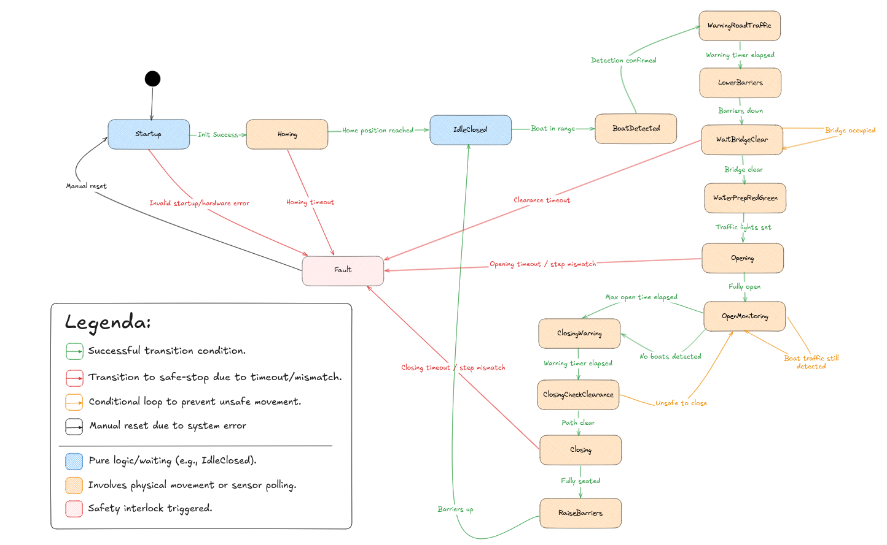

# Design: Modular and Timing-Safe Finite State Machine (FSM)

## 1. The Central Finite State Machine (FSM)

The bridge is controlled as a strict Finite State Machine (FSM). An FSM is a computational model used to design logic
where the system can be in exactly one of a finite number of states at any given time. Transitions between these states
only occur when specific "Guard Conditions" (events or sensor triggers) are met.

### 1.1 Research: Process Algebra and Protocol Choice

- **Process Algebra (CSP):** To ensure high-reliability, this design incorporates principles of Communicating Sequential
  Processes (CSP). By using Rust Embassy’s `select!` macro, the software can monitor "Fault" transitions (Red Arrows) in
  parallel with "Hardware" movements (Orange Boxes), ensuring the system is never "deadlocked".

- **Protocol Selection:** While industrial protocols like MAVLink or CANopen exist, a custom FSM was chosen to leverage
  Rust’s type-safe `enums`. This allows the ESP32-S3 to manage asynchronous I/O with microsecond precision without the
  overhead of complex external communication stacks.

---

## 2. Core State Transitions & Guards

The following table defines the logic that drives the bridge cycle based on reached conditions:

| From State          | To State            | Guard / Condition                   | Type     |
|:--------------------|:--------------------|:------------------------------------|----------|
| **Startup**         | **Homing**          | Init Success                        | Software |
| **Homing**          | **IdleClosed**      | Home position reached (Reed sensor) | Hardware |
| **IdleClosed**      | **BoatDetected**    | Boat in range (Ultrasonic)          | Hardware |
| **WaitBridgeClear** | **WaterPrep**       | Bridge clear (0kg on deck)          | Hardware |
| **WaitBridgeClear** | **WaitBridgeClear** | Bridge occupied (>0kg)              | Hardware |
| **Opening**         | **OpenMonitoring**  | Fully open (Stepper count)          | Hardware |
| **OpenMonitoring**  | **ClosingWarning**  | Max open time OR No boats detected  | Hardware |
| **ClosingCheck**    | **OpenMonitoring**  | Unsafe to close (IR blocked)        | Hardware |
| **ANY**             | **Fault**           | Timeout expired or Stepper mismatch | Software |

---

## 3. Safety Rules

The FSM enforces these non-negotiable rules:

- **No Premature Opening:** Barriers must be confirmed "Down" via servo limits before the stepper motor engages.
- **No Trap Closing:** If the IR beam is interrupted during the closing check, the bridge returns to the "
  OpenMonitoring" state immediately.
- **Positional Recovery:** On boot, the system must run the Homing sequence to find the physical "Zero" before entering
  autonomous mode.
- **Manual Override:** A "Manual Reset" is the only way to exit a Fault state, ensuring a human inspects the bridge
  after a safety timeout.
- **Fairness Policy:** A maximum-open-time policy prevents boat traffic from blocking the road indefinitely.

## 4. References

- 