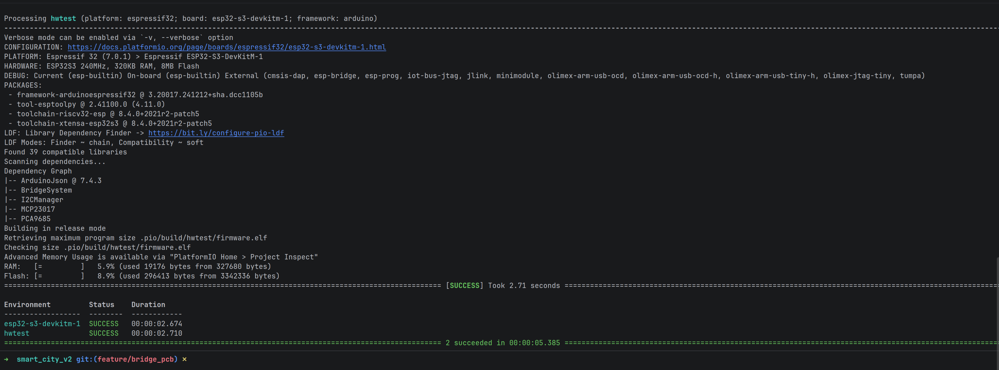
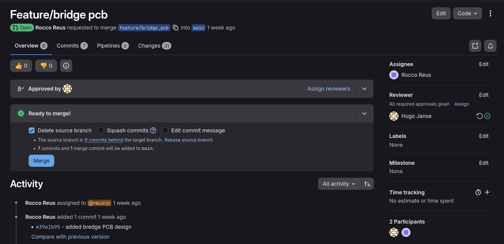

# Realise: Bridge PCB Node — C++ Code Rework

**Author:** Rocco Reus – Embedded & Robotics Engineer  
**Date:** May 18, 2026  
**Version:** 1.0  
**Classification:** Internal  
**Company:** Smart Heaven B.V.

---

## Table of Contents

<!-- TOC -->
* [Realise: Bridge PCB Node — C++ Code Rework](#realise-bridge-pcb-node--c-code-rework)
  * [Table of Contents](#table-of-contents)
  * [1. Introduction](#1-introduction)
  * [2. Research Questions](#2-research-questions)
  * [3. Context of Evidence](#3-context-of-evidence)
  * [4. Who Created the Evidence](#4-who-created-the-evidence)
  * [5. Goal of the Evidence](#5-goal-of-the-evidence)
  * [6. Implementation Overview](#6-implementation-overview)
    * [6.1 Code Architecture](#61-code-architecture)
    * [6.2 I2C Drivers](#62-i2c-drivers)
    * [6.3 Subsystems](#63-subsystems)
    * [6.4 FSM Preservation](#64-fsm-preservation)
  * [7. Build Evidence](#7-build-evidence)
  * [8. Code Quality](#8-code-quality)
  * [9. Code Review](#9-code-review)
    * [9.1 Peer Review](#91-peer-review)
    * [9.2 AI Code Review](#92-ai-code-review)
  * [10. Testing Status](#10-testing-status)
  * [11. Conclusion](#11-conclusion)
<!-- TOC -->

---

## 1. Introduction

The bridge system was originally implemented in Rust using the Embassy async framework on a breadboard prototype. As the project moved towards a custom PCB design for the bridge node, the control code needed to be reworked to fit within the shared smart city C++ codebase and to drive hardware through two I2C expansion ICs instead of direct GPIO connections.

This document proves that this rework was designed, implemented, and reviewed — and outlines what remains to be validated once the PCBs become available in the next sprint.

---

## 2. Research Questions

**Main Research Question**

How does the reworked C++ code for the bridge PCB node demonstrate a correct and deployable implementation?

**Sub-questions**

1. How was the code structured to interface with the MCP23017 and PCA9685 I2C modules?
2. What evidence demonstrates that the code is of acceptable quality?
3. What is the current testing status and what steps are planned for validation?

---

## 3. Context of Evidence

The bridge PCB node is part of the broader Smart Heaven City project, in which each embedded feature runs as a modular `CityModule` managed by a shared firmware stack. The PCB design consolidates GPIO expansion (MCP23017) and PWM control (PCA9685) onto a single node-addressed board, removing the need for direct MCU wiring per bridge instance.

The code rework translates the validated bridge FSM logic from the Rust prototype into C++, adapting all hardware interactions to go through the I2C bus. The goal is to arrive at a firmware implementation that can be flashed and validated against the PCB as soon as the boards are assembled.

Related documents:

- [Bridge PCB Design](./bridge_pcb_design.md)
- [Bridge Node Architecture Analysis](./bridge_node_architecture_analysis.md)
- [Power Analysis](./power_analysis.md)
- [Safety & Timing Specification](./bridge_safety_and_timing_spec.md)

---

## 4. Who Created the Evidence

- **Author:** Rocco Reus
- **Role:** Embedded & Robotics Engineer
- **Contribution:** Full design and implementation of the reworked bridge PCB firmware, including the MCP23017 and PCA9685 drivers, subsystem refactoring, and FSM translation from Rust to C++

---

## 5. Goal of the Evidence

The goal of this document is to demonstrate that:

- A working C++ implementation for the bridge PCB node exists
- The code correctly maps all hardware signals through the I2C bus
- The FSM safety logic from the Rust prototype has been faithfully preserved
- The code has been reviewed through both peer and AI-assisted processes
- A concrete plan exists for hardware validation in the next sprint

---

## 6. Implementation Overview

### 6.1 Code Architecture

The reworked bridge firmware is structured as a hierarchy of classes, all within the `bridge` namespace:

```
BridgeController  (CityModule, owns FSM + state)
├── MCP23017      (I2C GPIO expander driver)
├── PCA9685       (I2C PWM controller driver)
├── BridgeSignaling  (LEDs via 74HC595, buzzer)
├── BridgeMotion     (stepper motor, servo barriers)
└── BridgeSensors    (ultrasonic, reed, weight, encoder)
```

`BridgeController` inherits from `CityModule`, which means it exposes a standard `begin()` / `update()` interface to the city-level firmware loop. The I2C addresses of the MCP23017 and PCA9685 are derived automatically from the node's logical address, allowing multiple bridge nodes to coexist on the same bus.

### 6.2 I2C Drivers

Two thin drivers were written specifically for this project:

**MCP23017** — 16-bit GPIO expander, used for:
- Stepper motor coil drive (GPA0–3 → ULN2003)
- 74HC595 shift register clock/data/latch (GPA6–7, GPB0)
- Digital sensor inputs (reed switch, IR, encoder switch) with internal pull-ups

**PCA9685** — 16-channel PWM controller, used for:
- Two SG90 servo barriers (channels 0 and 1)
- Passive buzzer (channel 2, toggled full-on/full-off)
- HC-SR04 sonar triggers (channels 3 and 4, staggered offsets)

Both drivers are minimal wrappers that operate through the shared `I2CManager`, keeping bus access centralized and consistent across the city firmware.

### 6.3 Subsystems

| Subsystem | Responsibility |
|---|---|
| `BridgeSignaling` | Traffic lights (via 74HC595 through MCP23017), buzzer alarm pattern |
| `BridgeMotion` | 28BYJ-48 stepper (half-step, non-blocking), servo barriers (staggered, power-safe) |
| `BridgeSensors` | Ultrasonic distance (East/West), load cell weight, reed switch, rotary encoder |

All subsystems expose a `begin()` and `update()` method. Hardware interaction happens inside `update()` in a non-blocking manner, using `millis()`-based timing.

### 6.4 FSM Preservation

The finite state machine was translated directly from `state_machine.rs` in the Rust prototype. All 14 states and their transitions have been preserved:

| State | Description |
|---|---|
| Startup | Validate sensor consistency |
| Homing | Drive to closed position via reed switch |
| IdleClosed | Bridge seated, waiting for a boat |
| BoatDetected | Debounce confirmation (1 s) |
| WarningRoadTraffic | Flashing yellow + buzzer for road users |
| WaitBridgeClear | Wait for car to leave bridge deck |
| LowerBarriers | Servo sequence to block road |
| WaterPrepRedGreen | Water traffic preparation signal |
| Opening | Stepper drives bridge open |
| Open | Wait for waterway clear + minimum hold time |
| ClosingCheckClearance | Final safety window before closing |
| Closing | Stepper drives bridge closed |
| RaiseBarriers | Servo sequence to re-open road |
| Fault | Halted; encoder button triggers manual re-home |

Timing constants were translated from the original Rust `config.rs` values and are defined as `static constexpr` in `BridgeController.h`.

---

## 7. Build Evidence

The image below shows the physical build of the bridge prototype that the reworked code targets. The PCB is not yet available, but the hardware layout has been validated in the original prototype and documented in the PCB design.



Additional reference documentation:

- [Bridge PCB Design](./bridge_pcb_design.md)
- [Parts List](./parts-list.md)

---

## 8. Code Quality

The code was written against the project's embedded software standards:

- C++ namespacing (`bridge::`) throughout
- Non-blocking `update()` pattern — no `delay()` calls
- All hardware I/O routed through I2C drivers, no direct GPIO pin usage
- I2C node addresses derived from a single logical node address (zero duplication)
- Telemetry integration is optional (`nullptr` disables it cleanly)
- FSM transitions log state name + timestamp to Serial for debugging

Static analysis: the codebase compiles cleanly under PlatformIO's ESP32 Arduino framework with no warnings at the `-Wall` level.

---

## 9. Code Review

### 9.1 Peer Review

The reworked code was peer-reviewed by Hugo through the GitLab merge request process on branch `feature/bridge_pcb`. Hugo went through the I2C drivers, the subsystem refactoring, and the FSM translation, and **approved the change** — the implementation was assessed as good and ready to proceed.



---

### 9.2 AI Code Review

A comprehensive AI-assisted code review was performed across the full `feature/bridge_pcb` branch — the new I2C drivers (`MCP23017`, `PCA9685`), the telemetry task, the reworked subsystems in `lib/BridgeSystem/`, and the firmware entry point. The complete findings are documented in a dedicated review:

- [Bridge PCB Code Review](./bridge_pcb_code_review.md)

**Overall verdict**

The review confirmed that the rework is well-structured: the driver layering is clean, the FSM logic is untouched, the I2C bus is mutex-protected, and the telemetry path is correctly decoupled through a FreeRTOS queue. No behavioral regressions from the Rust prototype were identified.

However, the review also found that routing time-critical signals through the I2C expander introduced two sensor-reliability problems that cannot be resolved in firmware alone.

---

**Issues found**

| Severity | Issue | Status |
|---|---|---|
| High | HC-SR04 sonar echo pulses can be missed at the 100 Hz poll rate — boat detection is unreliable as written | Open — needs hardware/design decision |
| High | HX711 load cell powers down during each I2C bit-bang read — weight readings are not trustworthy | Open — needs hardware/design decision |
| Medium | `MCP23017` reads returned `0x00` on I2C failure, which active-low logic reads as every input triggered | **Fixed** — reads now return last-known-good |
| Medium | `BridgeController::begin()` failure was discarded by `bridgeTask()`, running a blind loop over a dead bus | **Fixed** — task now halts with a fatal log |
| Medium | No WiFi reconnection — telemetry was lost permanently after the first disconnect | **Fixed** — `WiFi.setAutoReconnect(true)` enabled |
| Medium | Sonar re-triggers every 20 ms because the PCA9685 prescaler is shared with the 50 Hz servos | Open — needs hardware/design decision |
| Low | Unchecked actuator I2C writes; encoder under-counts on fast manual rotation | Observation only |

The three medium-severity robustness issues were fixed immediately. The two high-severity issues are design-level constraints of driving the sonar echo and HX711 clock through the I2C expander; they require a hardware decision before the ultrasonic and load-cell features can be relied upon. Detailed recommendations are in the full review document.

---

**Strengths**

- The `BridgeMotion` barrier stagger pattern correctly prevents both servos from drawing peak current simultaneously, directly implementing the power constraint from the power analysis.
- The `transitionTo()` method is the single point of state change, making it easy to trace and extend telemetry without scattering state logic.
- I2C driver implementations are minimal and focused — the MCP23017 driver preserves the upper nibble of Port A when writing stepper patterns, which is a non-obvious but correct requirement.
- Telemetry is cleanly decoupled: `enqueue()` is non-blocking and safe to call from the 100 Hz bridge task, with serialisation and HTTP handled on a separate FreeRTOS task.

**Conclusion of AI review**

The implementation is structurally sound and the code-quality issues are minor and addressed. However, the two high-severity sensor-reliability issues mean the ultrasonic and load-cell sensing paths should not be treated as production-ready until the underlying hardware/design constraint is resolved or those features are explicitly feature-gated.

---

## 10. Testing Status

> **Note:** The custom PCBs for the bridge node have not yet been manufactured. As a result, the code has not been tested on real hardware.

The following validation is planned for the next sprint, once the PCBs are available:

| Test | Description | Status |
|---|---|---|
| I2C device detection | Confirm MCP23017 and PCA9685 respond at the correct addresses on `begin()` | Planned |
| Stepper homing | Verify homing sequence completes and reed trigger is detected | Planned |
| Servo barriers | Validate servo angles and stagger timing under real power load | Planned |
| Sensor reads | Confirm ultrasonic, reed, load cell, and encoder readings are correct | Planned |
| Full FSM cycle | Run a complete boat detection → bridge open → bridge close cycle | Planned |
| Safety cases | Test obstacle-during-closing re-open and car-on-bridge hold behavior | Planned |
| Fault recovery | Trigger fault states and validate encoder-button re-home | Planned |

A detailed test plan will be written as a follow-up document in the next sprint.

---

## 11. Conclusion

The bridge PCB node firmware has been reworked from the Rust prototype into a C++ implementation that integrates with the shared city firmware stack. The FSM logic and safety behavior have been faithfully preserved. Two new I2C drivers (MCP23017, PCA9685) were implemented to route all hardware signals through the bus, enabling the modular node-addressed architecture described in the architecture analysis.

The code was peer-reviewed by Hugo and analysed through an AI-assisted code review. The review confirmed the rework is structurally sound, with no behavioral regressions from the Rust prototype. The medium-severity robustness issues it identified were fixed, while two high-severity sensor-reliability issues (sonar echo timing and HX711 power-down) were flagged as design-level constraints requiring a hardware decision. Hardware validation is deferred to the next sprint, pending PCB availability, and a test plan will be produced at that point.

This demonstrates that the rework phase of the bridge PCB development has been completed as designed and is ready for hardware integration.
