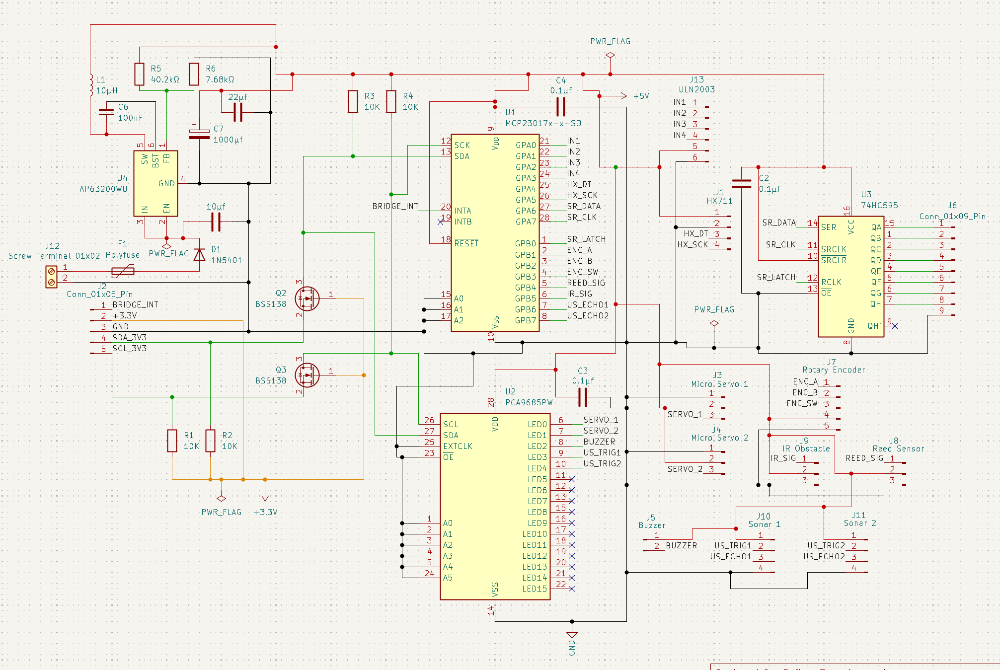
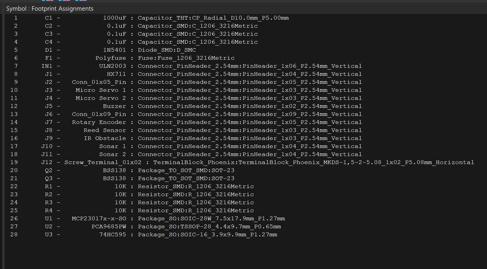
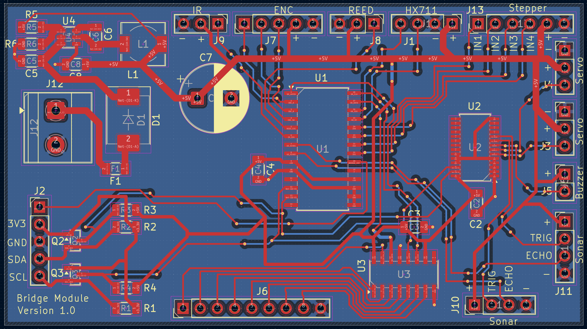
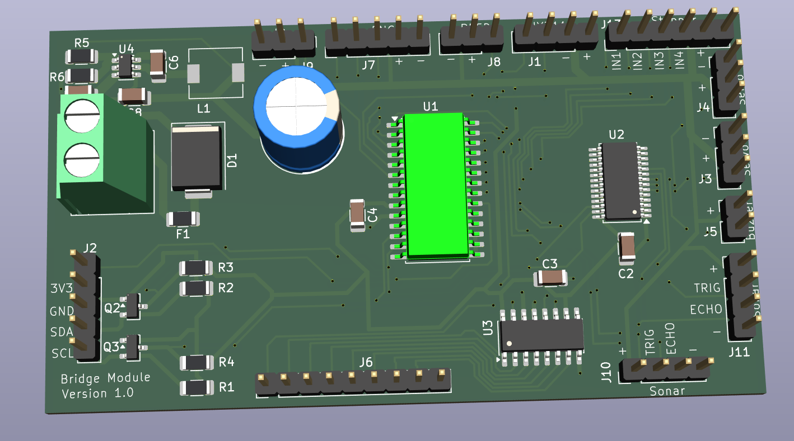
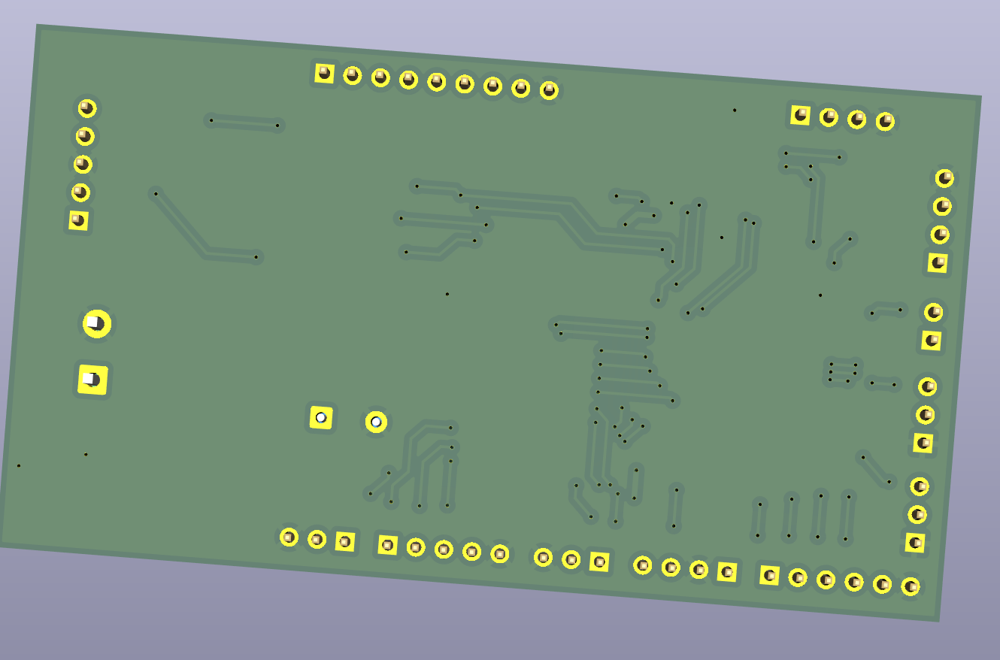

# Design: Bridge Node PCB Architecture

**Author:** Rocco Reus – Embedded & Robotics Engineer  
**Date:** May 7, 2026  
**Version:** 1.1  
**Learning Goal:** Design a self-contained PCB node for the drawbridge that communicates over I2C and can scale to multiple independent bridge instances

---

<!-- TOC -->
* [Design: Bridge Node PCB Architecture](#design-bridge-node-pcb-architecture)
  * [1. Introduction](#1-introduction)
  * [2. Design Requirements](#2-design-requirements)
  * [3. Schematic Overview](#3-schematic-overview)
    * [Figure 1 – Full Schematic](#figure-1--full-schematic)
    * [Figure 2 – Bill of Materials](#figure-2--bill-of-materials)
    * [Figure 3 – Routed PCB Layout](#figure-3--routed-pcb-layout)
    * [Figure 4 – 3D Model Top](#figure-4--3d-model-top)
    * [Figure 5 – 3D Model Bottom](#figure-5--3d-model-bottom)
  * [4. IC Selection & Rationale](#4-ic-selection--rationale)
    * [4.1 MCP23017 – I2C I/O Expander (U1)](#41-mcp23017--i2c-io-expander-u1)
    * [4.2 PCA9685PW – I2C PWM Driver (U2)](#42-pca9685pw--i2c-pwm-driver-u2)
    * [4.3 74HC595 – Shift Register (U3)](#43-74hc595--shift-register-u3)
    * [4.4 ULN2003 – Stepper Driver Array (IN1)](#44-uln2003--stepper-driver-array-in1)
  * [5. Signal & Pin Mapping](#5-signal--pin-mapping)
    * [5.1 MCP23017 Port A – Outputs & Fast Sensors](#51-mcp23017-port-a--outputs--fast-sensors)
    * [5.2 MCP23017 Port B – Digital Inputs](#52-mcp23017-port-b--digital-inputs)
    * [5.3 PCA9685PW – PWM Outputs](#53-pca9685pw--pwm-outputs)
    * [5.4 74HC595 – LED Shift Register Outputs (J6)](#54-74hc595--led-shift-register-outputs-j6)
    * [5.5 External Connectors Summary](#55-external-connectors-summary)
  * [6. Power Architecture](#6-power-architecture)
    * [6.1 Buck Converter (AP63200WU-7)](#61-buck-converter-ap63200wu-7)
    * [6.2 Input Protection](#62-input-protection)
    * [6.3 I2C Level Shifting (3.3V ↔ 5V)](#63-i2c-level-shifting-33v--5v)
    * [6.4 Decoupling Strategy](#64-decoupling-strategy)
  * [7. I2C Address Strategy](#7-i2c-address-strategy)
  * [8. Design Considerations](#8-design-considerations)
    * [Scalability](#scalability)
    * [Safety](#safety)
    * [Maintainability](#maintainability)
    * [Power](#power)
  * [9. Known Limitations & Open Items](#9-known-limitations--open-items)
  * [10. Conclusion](#10-conclusion)
<!-- TOC -->

---

## 1. Introduction

This document describes the PCB design for the Bridge Node — a self-contained hardware module that manages all
drawbridge sensors, actuators, and signaling via two I2C ICs and routes every signal through a single 5-pin header to
the ESP32-S3 City Hub.

The goal of this PCB is to:

- eliminate direct GPIO wiring between the ESP32-S3 and bridge hardware
- consolidate all bridge I/O onto a dedicated node that can be physically mounted on the bridge structure
- enable multiple bridge instances by selecting a unique I2C address range per PCB
- separate concerns: the City Hub firmware stays generic; all bridge-specific hardware lives on this board

**Manufacturing approach:** The PCB is designed for reflow oven soldering using the school's reflow facility. All three
main ICs (MCP23017, PCA9685PW, 74HC595) and all passive components (resistors, capacitors, MOSFETs, diode, polyfuse)
are SMD-mounted. This makes the board suitable for paste-and-reflow assembly rather than hand soldering, which improves
joint quality on the fine-pitch TSSOP-28 package of the PCA9685PW in particular. External components (servos, sensors,
stepper module) connect via through-hole pin headers, which are hand-soldered after reflow.

---

## 2. Design Requirements

| # | Requirement |
|---|-------------|
| R1 | All bridge I/O must be reachable via a shared I2C bus (SDA / SCL + 5V + 3.3V + GND) |
| R2 | The PCB must fit as a standalone node on or near the bridge structure |
| R3 | Multiple identical PCBs must coexist on the same bus (address-selectable) |
| R4 | Servo barriers must be driven with accurate PWM — not bit-banged |
| R5 | Stepper motor (28BYJ-48) requires open-collector drive — 5V, high-current outputs |
| R6 | Eight LED outputs (road + water signals, fault, status) must be addressable as a byte |
| R7 | All digital inputs (reed, IR, encoder, sonars) must be readable without consuming ESP32 pins |
| R8 | Power input must be protected against reverse polarity and overcurrent |
| R9 | I2C signals from the 3.3V ESP32-S3 must be level-shifted to 5V for the MCP23017 and 74HC595 |
| R10 | Power input must accept a wide DC voltage range (7–24V) and regulate it to a stable 5V on-board |

---

## 3. Schematic Overview

### Figure 1 – Full Schematic

<p>
  
</p>

**Figure 1:** Complete KiCad schematic of the Bridge Node PCB. Shows MCP23017 (U1) handling digital I/O, PCA9685PW (U2)
handling PWM outputs, 74HC595 (U3) driving the LED bank, ULN2003 driving the stepper, BSS138 MOSFETs performing
bidirectional I2C level shifting, and the AP63200WU-7 buck converter regulating the wide-range DC input to a stable 5V.

---

### Figure 2 – Bill of Materials

<p>
  
</p>

**Figure 2:** KiCad symbol-to-footprint assignment table. Lists all components with their reference designator,
value, and PCB footprint.

---

### Figure 3 – Routed PCB Layout

<p>
  
</p>

**Figure 3:** Routed two-layer PCB layout. Shows the compact placement of the SMD ICs and passives, the buck converter
section near the power input, level-shifter MOSFETs near the I2C bus connector (J2), and edge-oriented through-hole
headers for all external peripherals.

---

### Figure 4 – 3D Model Top

<p>
  
</p>

**Figure 4:** Top-side 3D render of the assembled PCB. Confirms component placement, assembly spacing, and the central
logic ICs alongside the buck converter and peripheral connectors.

---

### Figure 5 – 3D Model Bottom

<p>
  
</p>

**Figure 5:** Bottom-side 3D render. Shows the underside of the board and confirms no unintended component overlap or
clearance violations on the back copper layer.

---

## 4. IC Selection & Rationale

### 4.1 MCP23017 – I2C I/O Expander (U1)

The MCP23017 adds 16 independently configurable GPIO pins over I2C. It is used here to handle all digital inputs
(sensors) and the stepper motor direction outputs, replacing 13 direct ESP32 GPIO pins with two I2C lines.

**Why MCP23017:**

- 16 GPIOs in two 8-bit banks (Port A / Port B) — maps cleanly to the logical split between outputs and inputs
- Hardware interrupt outputs (INTA / INTB) allow the ESP32-S3 to wake on pin change instead of polling at 100 Hz — 
  useful for future power optimisation
- Address pins A0–A2 allow up to 8 devices on one bus — supports multi-bridge deployments
- Widely available in SOIC-28W package — reflow-solderable and large enough to inspect joints visually after oven

**Pull-ups:** R3 and R4 (10 kΩ) on SCK and SDA ensure the bus idles high. These are on the 5V side of the level
shifter because the MCP23017 runs at 5V.

---

### 4.2 PCA9685PW – I2C PWM Driver (U2)

The PCA9685PW provides 16 channels of 12-bit PWM over I2C. It replaces direct `ledc` (ESP32 PWM peripheral) usage for
the servo barriers and adds programmable PWM for the buzzer and ultrasonic trigger signals.

**Why PCA9685PW:**

- Hardware PWM generation — the ESP32-S3 does not need to spend any interrupt budget on servo timing
- 12-bit resolution (4096 steps) gives fine servo positioning without jitter
- `OE` (output enable, active low) allows all outputs to be tri-stated simultaneously — useful as a safety disable
- `EXTCLK` pin allows an external oscillator if the internal 25 MHz reference drifts — not used here but available
- Address pins A0–A5 allow up to 62 devices on one bus
- Available in TSSOP-28 package — fine pitch (0.65 mm), requires reflow rather than hand soldering. This is the primary
  reason a reflow oven is used for this board; hand-soldering TSSOP reliably is very difficult

**Channel assignment is intentionally sparse:** only LED0–LED4 are used. LED5–LED15 are reserved for future expansion
(additional lighting zones, second buzzer channel, extra trigger signals).

---

### 4.3 74HC595 – Shift Register (U3)

The 74HC595 drives the 8 LED outputs (road lights, water lights, status, fault) as a single byte. It is controlled by
three signals from MCP23017 Port A: SR_DATA, SR_CLK, SR_LATCH.

**Why keep the 74HC595 rather than using PCA9685 channels:**

- LEDs are on/off — they do not need 12-bit PWM. Using PCA9685 channels for LEDs wastes precision hardware on binary
  signals and increases firmware complexity (must set 12-bit values for a simple on/off state)
- A shift register byte write is deterministic and fast — all 8 LEDs update atomically in a single latch pulse
- The 74HC595 is already proven in the existing firmware and its output byte map is well-defined

**Output map (J6, 9-pin connector):**

| Shift bit | Signal | LED function |
|-----------|--------|--------------|
| Q0 | Road Red | Stop road traffic |
| Q1 | Road Green | Road traffic permitted |
| Q2 | Road Yellow | Warning / flashing |
| Q3 | Water Red | Vessel stop |
| Q4 | Water Green | Vessel passage permitted |
| Q5 | Status 1 | General status indicator |
| Q6 | Status 2 | General status indicator |
| Q7 | Fault | Fault state active |

The 9th pin on J6 is GND. Q7 (Fault) is the MSB, allowing a fault condition to be set with a single byte OR operation
in software.

The `OE` pin (active low) is pulled low permanently — outputs are always enabled. A future revision could connect `OE`
to a MCP23017 output for software-controlled blanking.

---

### 4.4 ULN2003 & HX711 – External Modules Mounted on PCB

Both the ULN2003 stepper driver module and the HX711 load cell ADC module are pre-built breakout boards that are
physically mounted on the Bridge PCB and connected via their pin headers.

**ULN2003 module (green board, 5-pin IN + 5-pin OUT):**  
The 28BYJ-48 stepper already comes paired with this module. Rather than placing a raw ULN2003 IC on the Bridge PCB,
the existing module is mounted directly and wired through the IN1 header. The stepper requires open-collector outputs
capable of sinking ~150 mA per coil at 5V — beyond what the MCP23017 can deliver (25 mA max per pin). The ULN2003
module handles that, and its built-in flyback diodes suppress the inductive spikes from coil switching.

**Signal path:** MCP23017 GPA0–GPA3 → IN1 header → ULN2003 IN1–IN4 → stepper coils

**HX711 module (load cell ADC):**  
The HX711 module has two load cell inputs (channel A and channel B), so a single module can read two weight pads —
both connected to the same HX711 instance on this PCB. The module mounts on the PCB and connects via J1 (4-pin
header: VCC, GND, DT, SCK).

Weight readings are taken once per second from the FSM. At that rate, reading 24 bits via MCP23017 I2C (~11 ms per
read) adds no meaningful overhead — the FSM does not wait for the result and the 1-second interval gives the HX711
plenty of settle time. This is a deliberate design choice: slow but simple and reliable.

---

## 5. Signal & Pin Mapping

### 5.1 MCP23017 Port A – Outputs & Fast Sensors

| MCP Pin | Signal | Direction | Connected to |
|---------|--------|-----------|--------------|
| GPA0 | IN1 | OUT | ULN2003 IN1 (stepper coil 1) |
| GPA1 | IN2 | OUT | ULN2003 IN2 (stepper coil 2) |
| GPA2 | IN3 | OUT | ULN2003 IN3 (stepper coil 3) |
| GPA3 | IN4 | OUT | ULN2003 IN4 (stepper coil 4) |
| GPA4 | HX_DT | IN | HX711 DOUT (load cell data) |
| GPA5 | HX_SCK | OUT | HX711 SCK (load cell clock) |
| GPA6 | SR_DATA | OUT | 74HC595 SER |
| GPA7 | SR_CLK | OUT | 74HC595 SRCLK |

### 5.2 MCP23017 Port B – Digital Inputs

| MCP Pin | Signal | Direction | Connected to |
|---------|--------|-----------|--------------|
| GPB0 | SR_LATCH | OUT | 74HC595 RCLK |
| GPB1 | ENC_A | IN | Rotary encoder channel A |
| GPB2 | ENC_B | IN | Rotary encoder channel B |
| GPB3 | ENC_SW | IN | Rotary encoder button |
| GPB4 | REED_SIG | IN | KY-025 reed switch signal |
| GPB5 | IR_SIG | IN | KY-032 IR obstacle signal |
| GPB6 | US_ECHO1 | IN | HC-SR04 East echo |
| GPB7 | US_ECHO2 | IN | HC-SR04 West echo |

### 5.3 PCA9685PW – PWM Outputs

| Channel | Signal | Connected to |
|---------|--------|--------------|
| LED0 | SERVO_1 | Micro Servo 1 (left barrier) |
| LED1 | SERVO_2 | Micro Servo 2 (right barrier) |
| LED2 | BUZZER | Buzzer (passive, PWM-driven tone) |
| LED3 | US_TRIG1 | HC-SR04 East trigger |
| LED4 | US_TRIG2 | HC-SR04 West trigger |
| LED5–LED15 | — | Reserved / unpopulated |

**Note on sonar triggers via PCA9685:** The HC-SR04 requires a 10 µs high pulse to trigger a measurement. The PCA9685
is configured at **50 Hz** (not the default 200 Hz). At 50 Hz one cycle is 20 000 µs; at 12-bit resolution each count
is ~4.9 µs. A 10 µs pulse is ~2 counts — well within range and easy to hit accurately. 50 Hz also matches the
standard servo update rate, so the same frequency setting serves both the trigger channels and the servo channels.

### 5.4 74HC595 – LED Shift Register Outputs (J6)

See the output map in section 4.3. J6 is a 9-pin header: pins 1–8 are QA–QH, pin 9 is GND.

### 5.5 External Connectors Summary

| Ref | Label | Pins | Purpose |
|-----|-------|------|---------|
| J2 | Conn_01x05_Pin | 5 | System bus input: +5V, +3.3V, GND, SDA_3V3, SCL_3V3 |
| J12 | Screw_Terminal_01x02 | 2 | Direct 5V power input (motors + PCB) |
| IN1 | ULN2003 | 6 | Stepper coil outputs to 28BYJ-48 |
| J1 | HX711 | 4 | Load cell ADC (VCC, GND, DT, SCK) |
| J3 | Micro Servo 1 | 3 | Left barrier servo (GND, +5V, PWM) |
| J4 | Micro Servo 2 | 3 | Right barrier servo (GND, +5V, PWM) |
| J5 | Buzzer | 2 | Passive buzzer (GND, PWM) |
| J6 | Conn_01x09_Pin | 9 | 74HC595 LED outputs + GND |
| J7 | Rotary Encoder | 5 | ENC_A, ENC_B, ENC_SW + 5V + GND |
| J8 | Reed Sensor | 3 | GND, +5V, REED_SIG |
| J9 | IR Obstacle | 3 | GND, +5V, IR_SIG |
| J10 | Sonar 1 | 4 | GND, +5V, US_TRIG1, US_ECHO1 |
| J11 | Sonar 2 | 4 | GND, +5V, US_TRIG2, US_ECHO2 |

---

## 6. Power Architecture

The power chain on this PCB is:

**Screw terminal (J12) → D1 (reverse polarity) → F1 (polyfuse) → AP63200WU-7 (buck) → 5V rail → C1 (bulk cap) → ICs and peripherals**

The board accepts any DC supply in the 7–24V range at 2A or more and regulates it to a stable 5V on-board. This means
the Bridge Node no longer depends on a pre-regulated 5V supply from the City Hub or an external regulator — any
suitable DC adapter or bench supply can power it directly.

### 6.1 Buck Converter (AP63200WU-7)

The AP63200WU-7 is a 2A synchronous buck converter from Diodes Incorporated. It replaces a direct 5V power input with
an on-board switching regulator, allowing a wide input range and eliminating the need for a separate regulated supply.

**Why a buck converter:**

- The bridge is physically located on the bridge structure, away from the City Hub. Running a long 5V cable from the
  Hub causes voltage drop under motor load. A local buck converter powered by a higher-voltage line avoids this.
- The 28BYJ-48 stepper and servos together can draw brief current peaks. A synchronous buck with a dedicated bulk cap
  handles these transients without the rail sagging.
- The wide input range makes the PCB compatible with whatever DC supply is available at the site (7V battery pack,
  9V adapter, 12V rail, etc.).

**Key components:**

| Ref | Component | Value / Part | Role |
|-----|-----------|-------------|------|
| U4 | AP63200WU-7 | 2A sync buck | Switching regulator IC |
| L1 | SRN6045TA-100M | 10 µH | Buck output inductor |
| R5 | CRCW120640K2FKEA | 40.2 kΩ | Feedback divider top (sets Vout) |
| R6 | CRCW12067K68FKEA | 7.68 kΩ | Feedback divider bottom (sets Vout) |
| C5 | GXT31CR6YA106KE01L | 10 µF | Buck input / output capacitor |
| C6 | 1206YC226MAT2A | 22 µF | Buck output bulk capacitor |

**Output voltage calculation:**  
The AP63200WU-7 feedback reference is 0.8V. With R5 = 40.2 kΩ and R6 = 7.68 kΩ:

```
Vout = 0.8V × (1 + R5 / R6) = 0.8 × (1 + 40200 / 7680) ≈ 5.0V
```

### 6.2 Input Protection

**D1 (S3A) – Reverse polarity protection:**  
A Vishay S3A power diode (3A continuous) is placed in series with the input from the screw terminal, before the buck
converter. If the connector is wired backwards, the diode blocks current flow and the PCB is protected.

**F1 (Polyfuse 1206L200) – Overcurrent protection:**  
A polyfuse is placed after D1. If a sustained fault occurs (e.g. a shorted servo or stalled stepper), the polyfuse
trips and resets automatically when the fault clears — no component replacement needed during demo operation.

**C1 (1000 µF, electrolytic) – Bulk reservoir:**  
A large bulk capacitor on the 5V output side of the buck absorbs inrush current spikes from servo startup and stepper
coil switching. Without this, transient load steps can cause brief voltage droops that reset the MCP23017 or PCA9685PW.

### 6.3 I2C Level Shifting (3.3V ↔ 5V)

The ESP32-S3 is a 3.3V device. The MCP23017 and 74HC595 run at 5V. Connecting 3.3V I2C lines directly to 5V devices
risks damage to the ESP32-S3 GPIO when the 5V device drives the bus high.

**Solution: BSS138 N-channel MOSFET level shifter (Q2, Q3)**

This is the standard open-drain bidirectional level shifter circuit:

- The MOSFET source is connected to the 3.3V side with a 10 kΩ pull-up (R1 / R2)
- The MOSFET drain is connected to the 5V side with a 10 kΩ pull-up (R3 / R4)
- When neither side is driving, both sides idle high (pulled to their respective rails)
- When the ESP32-S3 pulls the 3.3V side low, the MOSFET body diode conducts, pulling the 5V side low
- When a 5V device pulls the bus low, the MOSFET gate is above the source, the channel conducts, and the 3.3V side
  follows

The BSS138 is chosen because it is a standard part for this exact circuit, has a threshold voltage of ~0.8V (well
below the 3.3V gate drive), and is available in SOT-23.

**J2 (5-pin system bus connector)** brings in `SDA_3V3` and `SCL_3V3` from the ESP32-S3 side (post-level-shifter on
the Hub PCB, or direct if the Hub drives 3.3V). The Bridge PCB then level-shifts these internally to 5V for U1 and U3.

### 6.4 Decoupling Strategy

| Capacitor | Location | Purpose |
|-----------|----------|---------|
| C5 – 10 µF | Buck converter input/output | High-frequency filtering at the switching node |
| C6 – 22 µF | Buck converter output | Output ripple suppression |
| C1 – 1000 µF | 5V rail (output side of buck) | Bulk reservoir for motor transients |
| C2 – 0.1 µF | Near U3 (74HC595) VCC | High-frequency bypass for shift register switching |
| C3 – 0.1 µF | Near U2 (PCA9685PW) VDD | Bypass for PWM driver switching |
| C4 – 0.1 µF | Near U1 (MCP23017) VDD | Bypass for I2C I/O expander |

All 0.1 µF capacitors are SMD 1206. The 1206 footprint is large enough to place and reflow reliably, and can also be
hand-soldered for rework after reflow if a joint needs touching up.

---

## 7. I2C Address Strategy

Both the MCP23017 and PCA9685PW have hardware address pins that allow multiple devices of the same type on one bus.

| IC | Address pins | Default address | Max devices |
|----|-------------|----------------|-------------|
| MCP23017 (U1) | A0, A1, A2 (pins 15–17) | 0x20 (all low) | 8 |
| PCA9685PW (U2) | A0–A5 (pins 1–5, 24) | 0x40 (all low) | 62 |

For the Bridge Node PCB, the address scheme from [`city_config.h`](../../../apps/embedded/smart_city_v2/include/city_config.h)
reserves the `0x10–0x1F` range for bridge devices. In practice:

| Bridge instance | MCP23017 address | PCA9685PW address |
|----------------|-----------------|------------------|
| Bridge 1 (default) | 0x20 (A0=A1=A2=0) | 0x40 (all low) |
| Bridge 2 | 0x21 (A0=1) | 0x41 (A0=1) |
| Bridge 3 | 0x22 (A1=1) | 0x42 (A1=1) |

Address selection is done by bridging the address pads on the PCB (or adding a solder jumper in a future revision).

---

## 8. Design Considerations

### Scalability

The central design goal is that a second or third bridge needs no firmware changes to the City Hub — only a new PCB
with a different address selection. The 5-pin system bus connector (J2) is the only interface to the Hub. All
complexity is local to the node.

The PCA9685PW has 11 unused PWM channels and the MCP23017 has all ports fully mapped but still exposes INTA/INTB for
future interrupt-driven read. Both ICs have headroom for expansion.

### Safety

- The ULN2003 flyback diodes protect the MCP23017 from stepper inductive spikes
- The polyfuse prevents sustained overcurrent from damaging wiring or the power supply
- The reverse polarity diode prevents a wiring mistake from destroying the ICs
- The `OE` pin on the PCA9685PW allows all PWM outputs to be disabled in hardware — the firmware can use this as an
  emergency stop
- The INTA / INTB interrupt outputs from the MCP23017 are broken out but not currently connected to the ESP32-S3 — 
  a future hardware revision could wire these for interrupt-driven sensor reads

### Maintainability

- All external components connect via standard 2.54 mm pin headers — replaceable without soldering
- The screw terminal (J12) provides a removable power connection
- Each subsystem (stepper, servos, LEDs, sensors) has its own connector — individual components can be swapped or
  tested in isolation
- The hardware test build (`hwtest` PlatformIO environment) exercises all subsystems through the same drivers used in
  production

### Power

The on-board AP63200WU-7 buck converter accepts 7–24V DC and regulates it to a stable 5V, removing the dependency on a
pre-regulated supply from the City Hub or external regulator. This makes the node self-sufficient from a power
perspective — it only needs the I2C lines from J2 and a raw DC feed on J12.

The servo + stepper mutual exclusion constraint (documented in [`power_analysis.md`](./power_analysis.md)) still
applies. The PCB does not enforce this in hardware — it is a firmware responsibility in `BridgeMotion`. The 1000 µF
bulk cap on the 5V output side buys ~10 ms of hold-up during a coil switching transient at 500 mA draw, which is
sufficient for the 200 ms servo stagger window.

---

## 9. Known Limitations & Open Items

### 9.1 Open Items

| Item | Description |
|------|-------------|
| Buck converter max input voltage | The AP63200WU-7 datasheet should be verified against the 24V upper end of the stated input range. Confirm the absolute maximum input rating before connecting a 24V supply. |
| OE hard-wired low on 74HC595 | The `OE` pin is permanently pulled low — no software blanking of the LED outputs. A future revision should connect `OE` to a spare MCP23017 output to allow the firmware to blank all LEDs during fault state. |
| Address pads not yet exposed | The A0–A2 pads on MCP23017 and A0–A5 on PCA9685PW are wired to GND in the current schematic. A future revision should break these out as solder jumpers or a 3-pin header for easier address selection without rework. |
| Water Red + Green simultaneous output | See [`bridge_roadmap.md`](./bridge_roadmap.md) Phase 2. The 74HC595 byte mask for Q3+Q4 simultaneous high needs a firmware fix independent of the PCB design. |

---

## 10. Conclusion

The Bridge Node PCB consolidates the entire drawbridge hardware interface onto a single board connected to the City Hub
via five wires: power, ground, 3.3V reference, SDA, and SCL.

By combining:

- the MCP23017 for digital I/O (stepper drive, sensor inputs, shift register control)
- the PCA9685PW for hardware PWM (servo barriers, buzzer, sonar triggers)
- the 74HC595 for atomic LED byte output
- the ULN2003 for open-collector stepper drive
- bidirectional I2C level shifting for safe 3.3V ↔ 5V operation
- the AP63200WU-7 buck converter for on-board power regulation (7–24V DC → 5V)

the design meets all ten requirements defined in section 2. The node is address-selectable, independently powered from
any suitable DC supply, and physically self-contained — ready to be mounted on the bridge structure and replicated for
future bridge instances without any changes to the City Hub firmware or wiring.

The PCB has been fully routed (two-layer layout) and validated in 3D model view. See Figures 3–5 for the routed layout
and assembly renders.

> **Next step:** Order PCB, reflow SMD components, hand-solder headers, mount ULN2003 and HX711 modules, and bring up
> each subsystem using the `hwtest` PlatformIO build before flashing the full FSM firmware.
