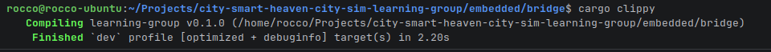
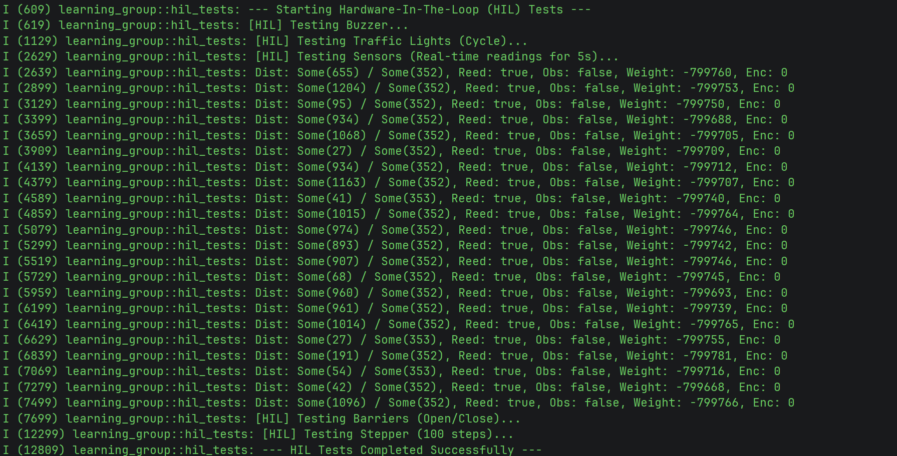

# Realise: Smart Drawbridge Prototype Implementation

**Author:** Rocco Reus – Embedded & Robotics Engineer  
**Date:** April 4, 2026  
**Version:** 2.0

---

## 1. Context of the Evidence

This evidence represents the realization of the Smart Drawbridge prototype developed during Sprint 1 and further refined in Sprint 2.

The bridge is part of the Smart Heaven City project, where multiple embedded systems must eventually be integrated into a single City Hub.

This prototype serves as a standalone system to validate:

- state-driven control logic
- safe interaction between sensors and actuators
- handling of real-world edge cases

---

## 2. Who Created the Evidence

- Author: Rocco Reus
- Role: Embedded & Robotics Engineer
- Contribution: Full design and implementation of the Smart Drawbridge prototype, including hardware integration, software development, testing, and validation

---

## 3. Goal of the Evidence

The goal of this evidence is to demonstrate that the Smart Drawbridge prototype:

- exists as a real physical system
- operates correctly according to its design
- safely handles both normal operation and edge cases
- has been validated through testing, code review, and hardware analysis

---

## 4. Introduction

This section presents the realization of the Smart Drawbridge prototype. The goal of this implementation is to validate that the designed system operates correctly in a real-world setup.

The implementation verifies:

- the correctness of the finite state machine (FSM)
- safe interaction between sensors and actuators
- stable hardware operation under power constraints
- reliability of the Rust-based control system

---

## 5. Implementation Overview

### Hardware Setup

The prototype consists of:

- ESP32-S3 microcontroller
- Stepper motor + ULN2003 driver
- 2x SG90 servo motors (barriers)
- HC-SR04 ultrasonic sensors
- HX711 load sensor + load cells
- IR obstacle sensor
- Rotary encoder
- Reed switch
- SN74HC595 shift register

Documentation:

- [Technical Specifications & BOM](./bridge_components_list.md)
- [Wiring and Power Design](./bridge_wiring_and_power.md)
- [Power Analysis](./power_analysis.md)

---

### Software Setup

The system is implemented in Rust using the Embassy async framework.

Key characteristics:

- asynchronous task execution
- finite state machine (FSM) driven logic
- modular trait-based hardware abstraction
- safe concurrency without blocking

FSM reference:

- [FSM Design](./bridge_design.md)

---

## 6. Implementation Process

### Step 1 – Hardware Integration

All sensors and actuators were connected according to the defined wiring and power architecture.

---

### Step 2 – Software Implementation

The control system was implemented as a finite state machine using Rust enums and asynchronous tasks.

---

### Step 3 – System Testing

The system was tested in multiple real-world scenarios.

---

## 7. Results

---

### 7.1 Normal Operation

#### 🎥 What am I watching?

This video shows the **complete bridge cycle from start to finish**.

---

#### Expected behavior

- Full cycle runs automatically
- No unexpected stops
- Correct sequence order

---

#### Observed behavior

The system performs the full sequence correctly and follows the FSM logic.

---

## 7.2 Edge Case Validation

---

### Scenario 1 – Obstacle under bridge

#### 🎥 What am I watching?

This video shows what happens when an object blocks the bridge while its open sequence is in progress.

---

#### Expected behavior

- Bridge stays open until obstacle is removed
- System waits until obstacle is gone

---

#### Observed behavior

Bridge transitions from **ClosingCheck → OpenMonitoring**, preventing unsafe closure.

---

### Scenario 2 – Car on bridge (weight detection)

#### 🎥 What am I watching?

This video shows behavior when weight is detected on the bridge deck.

---

#### Expected behavior

- Bridge does NOT open while occupied
- System waits until weight is gone

---

#### Observed behavior

System remains in **WaitBridgeClear** until the load is removed.

---

## 7.3 FSM Validation

The observed behavior matches the FSM:

- ClosingCheck → OpenMonitoring
- WaitBridgeClear → WaitBridgeClear
- IdleClosed → BoatDetected

This confirms correct implementation of the design.

---

## 8. Verification Against Safety Specification

To validate the correctness of the implementation, the system was tested against the predefined safety and timing requirements.

The full specification is documented in:
- [Safety & Timing Specification](./bridge_safety_and_timing_spec.md)

---

### What is shown?

This section shows how the prototype behavior aligns with the defined acceptance criteria and safety functions.

---

### Verification Results

#### AC-01 – No opening while bridge deck is occupied

- Test: Object placed on bridge during opening request
- Result: Bridge remained in WaitBridgeClear
- Status: ✅ Passed

---

#### AC-02 – Reopen on obstacle during closing

- Test: IR beam interrupted during closing
- Result: Bridge reopened immediately
- Status: ✅ Passed

---

#### AC-03 – Homing after startup

- Test: Power cycle and observe startup
- Result: System reached IdleClosed state
- Status: ✅ Passed

---

#### AC-04 – Barrier before bridge motion

- Test: Trigger opening sequence
- Result: Barriers fully lowered before stepper activation
- Status: ✅ Passed

---

#### AC-05 – LED self-test

- Test: Observe startup sequence
- Result: LED sweep completed successfully
- Status: ✅ Passed

---

### Conclusion

The implementation satisfies all defined safety requirements and acceptance criteria for the prototype.

## 9. Software Validation

### Code Quality

`cargo clippy` → no warnings:

unit tests → FSM validated:

### Code Review

The system was reviewed through both human and AI-assisted processes.

#### Peer Review (GitLab)

The code was reviewed by a team member using GitLab merge requests.

Key feedback included:

- Splitting large test functions into smaller, component-specific tests (e.g., separating buzzer, lights, and sensor tests) to improve readability and reusability
- Adding more inline comments and file-level descriptions to make complex logic easier to understand
- Noting that some functions had too many responsibilities and could be further modularized

This feedback confirms that the system structure is correct, while also identifying improvements in maintainability and clarity.

Evidence of this review is shown below:

Additionally, the merge request discussion can be found here:
- [GitLab Merge Request](https://gitlab.fdmci.hva.nl/studio/smart-cities/projecten/2025-2026-semester-2/city-sim-learning-group/city-smart-heaven-city-sim-learning-group/-/merge_requests/7)

---

#### AI-Assisted Code Review

An additional review was performed using an AI model → [Bridge Code Review](./bridge_code_review.md)

Findings:
- no behavioral regressions
- improved modularity through trait-based design
- maintainable architecture

---

## 10. Hardware Validation

- No MCU resets
- Stable sensor readings
- Reliable actuator control

Sequential activation prevents power overload.

---

## 11. Reflection

Key insights:

- FSM improves safety significantly
- async Rust is very suitable
- hardware limits require software control

---

## 12. Next Steps (Transfer)

- integrate into City Hub
- combine Rust + C++
- scale to multi-tile system

---

## 13. Conclusion

The Smart Drawbridge prototype is a working, validated embedded system that:

- operates correctly
- handles edge cases
- follows the defined design

This confirms the success of both the implementation and architecture.