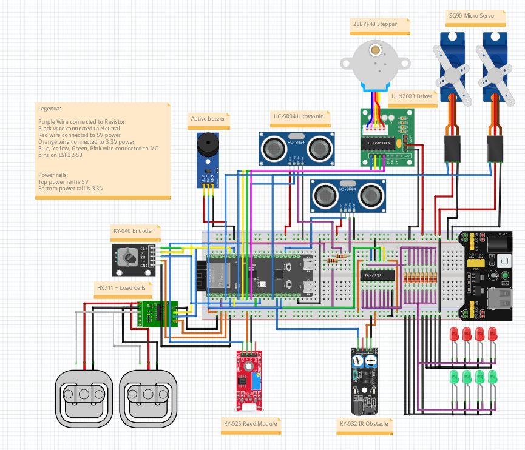

# Wiring and Power Design

## 1. Electrical Strategy

To ensure the Smart Drawbridge is reliable and safe, the wiring is organized into three isolated domains: **Logic**,
**Sensing**, and **Actuation**. This separation prevents high-current motor noise from interfering with sensitive sensor
readings or causing the MCU to reset.

**Note on Layout:** All wires in the schematic are routed at **90-degree angles** to improve readability and match
standard PCB design practices.

---

## 2. Power Architecture & Constraints

The system utilizes a dual-source power strategy to decouple the high-current mechanical load from the sensitive logic
controller.

### 2.1 Dual-Source Power Domains

- **Logic Controller (Source A):** The **ESP32-S3** is powered independently via its Type-C USB port. This ensures that
  voltage "sags" on the motor rails do not cause the MCU to reset or brown out.
- **Peripheral Rails (Source B):** All other components are powered by the **Keyestudio KS0534 Power Module**, which
  provides regulated 5V and 3.3V rails from an external 9V DC adapter.

### 2.2 Component Partitioning

- **5V Actuator Rail (Red Wires):**
    - 28BYJ-48 Stepper Motor & Driver Board
    - 2x SG90 Micro Servos
    - 2x HC-SR04 Ultrasonic Sensors
    - 1x Active Buzzer
- **3.3V Logic Rail (Orange Wires):**
    - KY-040 Rotary Encoder
    - HX711 Amplifier + 2x Load Cells
    - KY-025 Reed Module
    - KY-032 IR Obstacle Sensor
    - SN74HC595N Shift Register (Driving 8 LEDs)

## 2.3 Power Budgeting and Critical Constraints

The Keyestudio KS0534 provides a maximum total current of 500mA.

- **Peak Demand Issue:** Detailed calculation shows a theoretical peak demand of ~1460mA if all components stall
  simultaneously.
- **Safety Reference:** For a full breakdown of individual component draws and thermal risks, see
  the [Power Usage Analysis](./power_analysis.md).
- **Software Mitigation:** The Rust Embassy architecture enforces sequential activation (staggering motor starts) to
  keep the instantaneous draw below the 500mA hardware limit.

## 2.4 Critical Constraint: Common Ground

Because the system uses two separate power sources (USB-C and KS0534), a Common Ground is mandatory. All GND pins from
the ESP32-S3 and the power module must be connected to a shared ground rail on the breadboard to provide a unified
reference for signal and power.

---

## 3. Signal Integrity and Debugging

To make the diagram and physical build maintainable, a strict color-coding protocol is used:

- **Blue Wires:** Digital/Analog I/O signals (Sensors, Encoder, etc.).
- **Purple Wires:** Shift Register output lines to the LED array.
- **Black Wires:** Common Ground (GND) shared across all components to ensure a stable reference.

### 3.1 LED and Resistor Clarity

- **Anodes:** The bent leg (Anode) of each LED is connected to the resistors.
- **Resistor Placement:** Wires are routed around resistor bodies to ensure color bands remain visible for value
  verification.

---

## 4. Hardware Verification (POST)

To ensure the wiring is correct before operation, the system performs a **Power-On Self-Test**:

1. **LED Sweep:** Cycles all traffic lights via the **74HC595 Shift Register.**
2. **Servo Home:** Moves barriers to the open position to verify PWM signal.
3. **Buzzer Chirp:** Confirms the audible alarm circuit is closed.

---

## 5. Wiring Diagrams

For detailed pin-to-pin mapping, refer to the **[Technical Specs](./bridge_components_list.md)**.

## 6. References

- [28BYJ-48 Stepper Motor Wiring, Speed, and Applications](https://www.ic-components.com/blog/28BYJ-48-Stepper-Motor-Wiring,Speed,and-Applications.jsp)
- [SG90 Servo Datasheet](https://www.kjell.com/globalassets/mediaassets/701916_87897_datasheet_en.pdf)
- [4.2] Keyestudio. (n.d.). KS0534 Keyestudio Power Module Wiki. https://wiki.keyestudio.com/KS0534_Keyestudio_Power_Module