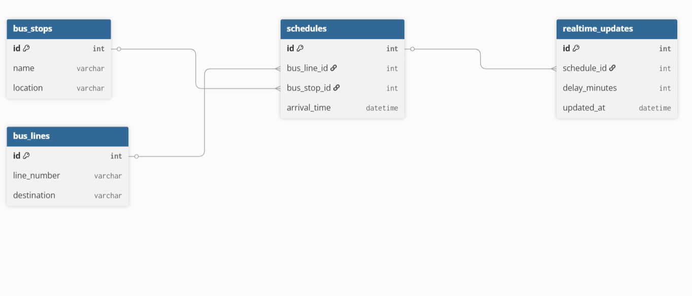
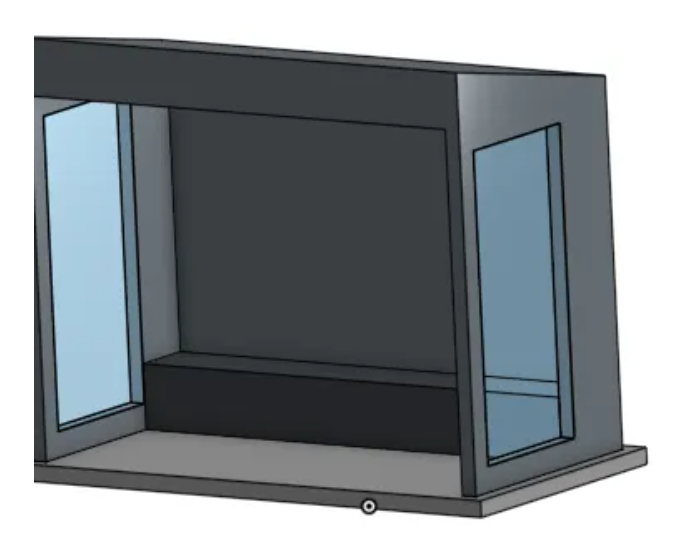
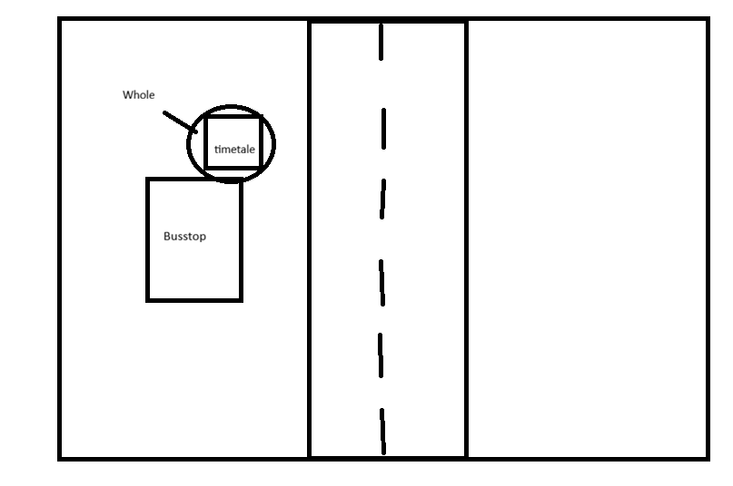
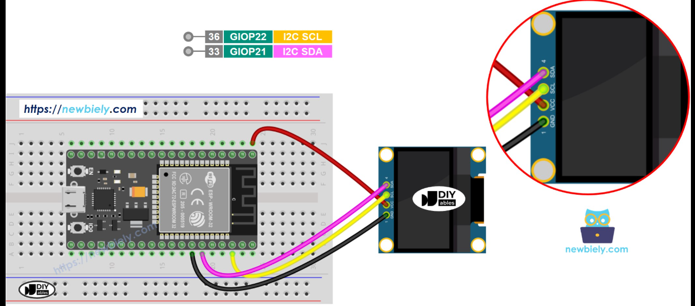

# Busstop design
This project describes the design of a smart bus stop using an ESP32. The bus stop displays bus times on an OLED screen and can detect when a bus is approaching using a sensor. In addition, the backend retrieves real-time data such as the current time and bus arrival times.

For the realization of the bus stop, the following materials are needed to complete it:

| Part number| Manufacturer | Description| Quantity | Price (incl VAT) | Subtotal (incl VAT) | Example url:
| :--- | :--- | :--- | :--- | :--- | :--- | :--- |
| ESP32-S3-DevKitC-1 | Espressif Systems | ESP32-S3 DevKitC-1 WiFi & Bluetooth development board | 1 | euro 12,50 | euro 12,50 |[ESP32-S3](https://www.tinytronics.nl/en/development-boards/microcontroller-boards/with-wi-fi/espressif-esp32-s3-devkitc-1-n32r16v-32mb-flash-16mb-psram) |
| SSD1306-0.96-I2C | Solomon Systech | 0.96 inch OLED display module 128x64 I2C SSD1306| 2 | euro 5,95 | euro 5,95 | [OLED-Display](https://www.tinytronics.nl/en/displays/oled/oled-display-0.96-inch-i2c)|
| HC-SR04 | ElecFreaks | HC-SR04 ultrasonic distance sensor module | 1 | euro 3,50 | euro 3,50 |[Sensor](https://www.tinytronics.nl/en/sensors/distance/ultrasonic-distance-sensor-hc-sr04) |
| MB-102 | HW Group | MB-102 solderless breadboard power supply module | 1 | euro 4,25 | euro 4,25 | [Breadboard](https://www.tinytronics.nl/en/power/power-supplies/breadboard-power-supply-mb102) |
| DUPONT-MM-20 | SparkFun | Dupont jumper wires male-to-male 20 cm | ~10 | euro 0,15 | euro 1,50 | [Jumpwires](https://www.sparkfun.com/jumper-wires-standard-7-m-m-30-awg-30-pack.html) |

## The goal of the busstop


The goal of this design is to create a realistic bus stop simulation that resembles real bus stops in the Netherlands.

The bus stop must:
- display the current time
- show in how many minutes the bus will arrive (for example: “Bus arrives in 7 min”)
- respond when a bus is detected
```
Bus 42 

14:23
Arrives in 7 min
```
The system consists of three main components:
- ESP32 (microcontroller)
  
  Processes all data and controls the sensors and displays

- Backend (server / database)

  Provides the current time and bus schedules

## how does the system work?

The system consists of three layers:

1. **Hardware layer**

* ESP32 (microcontroller)
* OLED display
* Ultrasonic sensor

2. **Software layer**

* Program running on the ESP32

3. **Backend layer**

* Server / API
* Database with bus schedules

## ERD



The database for the smart bus stop is designed to store information about bus stops, bus lines, schedules, and real-time updates. All tables work together to provide the correct bus information to the system.

First, there is the bus_stops table. This table contains all bus stops in the system. Each bus stop has an ID, a name, and a location. For example, a bus stop could be “Central Station” with its location.

for exemple:
```
id: 1
Name: Denzelstraat
Location: Tile from Denzel
```

Next, there is the bus_lines table. This table stores information about bus lines. Each bus line has a line number and a destination. For example
```
id: 1
lineNumber: 42
destination: Tile from Roco
```
The most important table is the schedules table. This table connects bus lines and bus stops. It stores the planned arrival time of a specific bus line at a specific bus stop. This means that one bus line can appear at multiple bus stops, and one bus stop can have multiple bus lines.

The schedules table has relationships with both the bus_lines table and the bus_stops table. This is done using foreign keys:
```
bus_line_id links to the bus_lines table

bus_stop_id links to the bus_stops table
```
This creates a many-to-many relationship between bus lines and bus stops, which is solved using the schedules table.

Finally, there is the realtime_updates table. This table stores delays or updates for a specific schedule. For example, if a bus is 2 minutes late, this information is stored here. Each realtime update is linked to one schedule using the schedule_id.

When the system is running, the backend uses these tables together. It looks at the schedules, checks if there are any delays in realtime_updates, and combines this with the bus line information. Then it calculates how many minutes are left until the bus arrives.

This final result is sent to the ESP32, which displays the information on the OLED screen.

## The 3d busmodel and tile design



The 3D model of the bus stop will be designed to closely resemble a real ABRI bus shelter, with a simple but realistic structure that includes a roof, side panels, and a front-facing display area. The OLED screen will be placed at the front where passengers can easily read the bus information, while the ultrasonic sensor will be positioned facing the road to detect incoming buses. The ESP32 and wiring will be hidden inside or underneath the structure to keep the design clean and safe. This design is chosen because it balances realism and practicality, making the model easy to build while still clearly demonstrating how real bus stops are structured and how the technology is integrated into the environment.




## embedded design

The OLED display is connected to the ESP32 using four jumper wires through the I2C interface. The VCC pin of the OLED is connected to the 3.3V pin on the ESP32 to supply power. The GND pin is connected to the GND pin of the ESP32 to complete the circuit. For communication, the SDA pin (data line) of the OLED is connected to GPIO 21 on the ESP32. These two wires allow the ESP32 to send data to the display.



