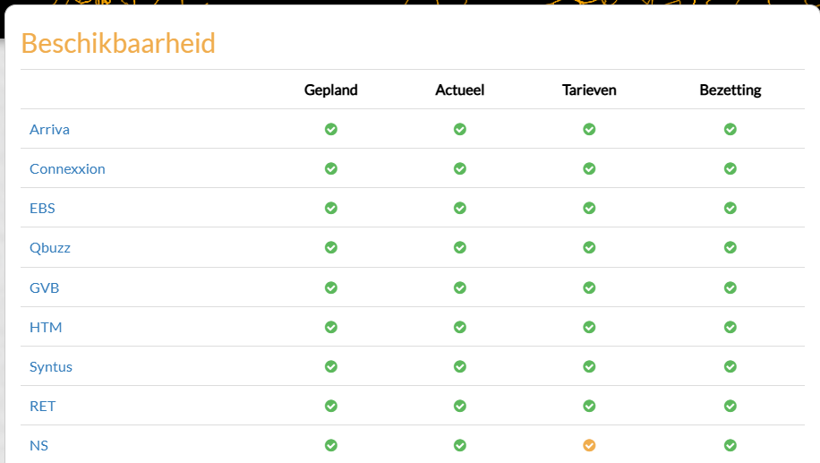

# Research: Bus Stops and Bus Timetables in the Netherlands

Public transport in the Netherlands is organized by different authorities. The national government sets the general rules for public transport. Regional governments, such as provinces and transport regions, are responsible for organizing bus transport in their area.

Examples of transport companies in the Netherlands include:
- Arriva
- Connexxion
- Qbuzz
- GVB
- RET

These companies operate buses according to the rules set by the regional authorities. (Ministerie van Infrastructuur en Waterstaat, 2018)

## Management of Bus Stops

Bus stops are usually managed by the municipality. The municipality decides where bus stops are placed and is responsible for maintaining the infrastructure.

A typical bus stop often includes:
- an ABRI (bus shelter) with a roof and seating (3d model)
- a bus stop pole with route information (3d model)
- a display with bus arrival times (oled screen)
- sometimes an advertising screen (oled screen)

Some modern bus shelters also include extra features such as lighting, green roofs, or digital information screens.

## Digital Bus Timetables

Many modern bus stops have a digital display that shows the arrival times of buses. This information usually comes from a database with public transport data.

This database contains information such as:
- bus routes
- bus stop locations
- scheduled departure times
- real-time delays

The data is updated regularly so passengers can see when the next bus will arrive.

image 1: busstop example

## How does Public Transport Data and Databases be regulated 

The "databank Nationale Data Openbaar Vervoer" (NDOV) is a central database in which all important information about public transport in the Netherlands is collected. This database contains both static information and real-time travel information.

The static information consists of scheduled timetables, while the real-time information includes, for example, delays, cancelled trips, and the current status of vehicles. As a result, the system can always provide travelers with the most up-to-date information.

The NDOV database contains data for various forms of public transport, such as buses, trams, and metros. Different types of data are stored and shared for these modes of transport.

For example, the database includes:
- scheduled timetables, indicating when vehicles are planned to operate
- real-time information about punctuality, such as delays
- information per stop, such as notifications or additional text information
- updates about changes in the operational process
- fare information, such as travel prices, used for applications like 9292.nl

These data are provided by transport companies and then centrally stored via NDOV. Other systems, such as travel apps and digital displays at bus stops, use this data to inform travelers. (NDOV, n.d.-b)

(image2 : who works with NDOV)

## Cost of a busstop
The cost of a bus stop (also called an ABRI) can vary depending on the size, materials, and extra features such as lighting or digital screens. Basic bus shelters can cost around €2,800 to €5,000 for standard models made of steel and glass.

More advanced bus stops, for example with digital displays, lighting, or larger structures, can be significantly more expensive. In some cases, including installation and infrastructure, the total cost can increase to tens of thousands of euros. (SKWshop, z.d.-b)

In addition to construction costs, there are also operational costs, such as maintenance and advertising panels. For example, advertising space in a bus stop can cost around €75–€110 per week per shelter, depending on the location. (Rosa, 2025b)

## Safty regulations
Safety is an important aspect of bus stop design. Modern bus stops are built using materials and design choices that improve safety for passengers.

First, many bus shelters are made with hardened safety glass and strong steel constructions. These materials are designed to be vandalism-resistant and durable, which is important in public spaces. (SKWshop, z.d.-b)

In addition, bus stops are often placed in visible and well-lit locations. Lighting increases safety at night and makes passengers feel more secure while waiting.

# sources
1. Ministerie van Infrastructuur en Waterstaat. (2018, 23 februari). Organisation of public transport. Mobility, Public Transport And Road Safety | Government.nl. https://www.government.nl/topics/mobility-public-transport-and-road-safety/public-transport/organisation-of-public-transport

2. Bochen, N. (2024, 20 maart). Public transportation in the Netherlands – What you need to know to get around. Adams Multilingual Recruitment. https://adamsrecruitment.com/blog/public-transportation-in-the-netherlands-what-you-need-to-know-to-get-around

3. NDOV. (z.d.). Vervoerregio Amsterdam. https://vervoerregio.nl/artikel/20181119-ndov

4. NDOV loket. (z.d.). https://ndovloket.nl/  

5. SKWshop. (z.d.). Busabri kopen | Bushokjes voor openbare ruimte | SKWshop. https://www.skwshop.nl/bushokjes/?srsltid=AfmBOopDMHn-2KUcXE6LBuqDaUOykgbk5ze0ewQ0j0zR8ycpX-ZSNzzV

6. Rosa. (2025, 19 februari). Bushokje reclame ➔. One Media. https://onemedia.nl/bushokje-reclame/