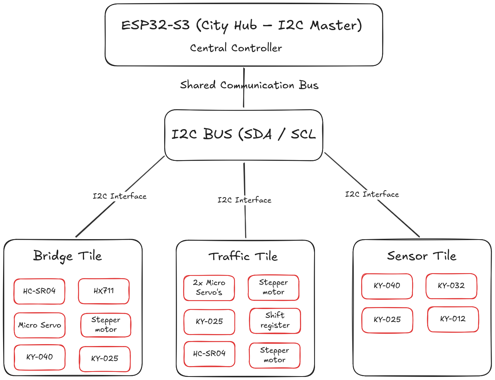
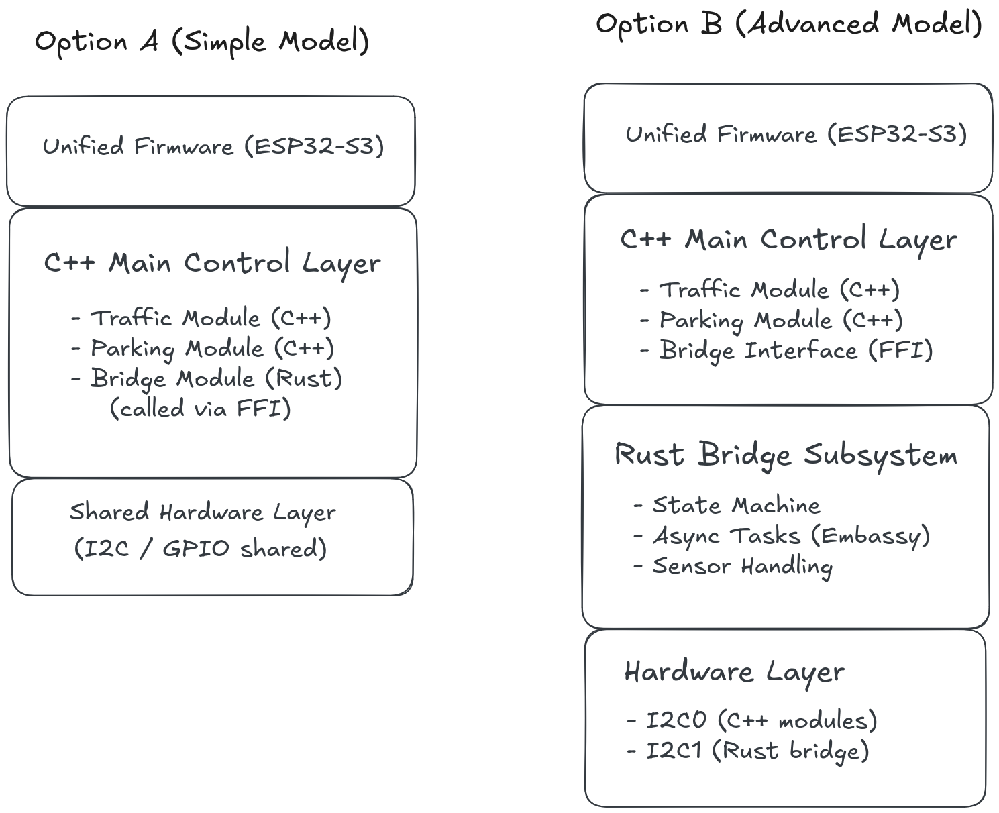

# Advice Report: Standardizing Communication and Integration for the City Hub Architecture

**Author:** Rocco Reus – Embedded & Robotics Engineer  
**Date:** April 3, 2026  
**Version:** 2.0
**Subject:** Evaluation of Hardware Interfacing, Protocol Scalability, and Cross-Language Firmware Integration

---

<!-- TOC -->
* [Advice Report: Standardizing Communication and Integration for the City Hub Architecture](#advice-report-standardizing-communication-and-integration-for-the-city-hub-architecture)
  * [1. Introduction](#1-introduction)
  * [2. Target Audience](#2-target-audience)
  * [3. Problem Statement](#3-problem-statement)
  * [4. Hardware Scalability](#4-hardware-scalability)
    * [Analysis](#analysis)
    * [Sub-conclusion](#sub-conclusion)
  * [5. Communication Standard](#5-communication-standard)
    * [Analysis](#analysis-1)
    * [Sub-conclusion](#sub-conclusion-1)
  * [6. Firmware Integration](#6-firmware-integration)
    * [Analysis](#analysis-2)
    * [Sub-conclusion](#sub-conclusion-2)
  * [7. Main Conclusion](#7-main-conclusion)
  * [8. Most Viable Option](#8-most-viable-option)
  * [9. References](#9-references)
<!-- TOC -->

---

## 1. Introduction

The development of the Smart City “City Hub” project requires the integration of multiple independently developed
modules into a single embedded system. Each team member develops a separate functional tile, such as traffic systems,
sensor modules, or infrastructure components, all of which must ultimately operate within a unified system.

The proposed architecture must be applicable across all modules developed within the team, ensuring that independently
developed components can be integrated without requiring major redesign.

The project introduces several technical challenges, including hardware scalability, communication between modules, and
the integration of multiple programming languages into a single firmware. These challenges must be addressed to ensure
that the final system is reliable, maintainable, and compliant with the requirement of delivering a single firmware
image.

This report is intended for project team members and technical evaluators involved in the City Hub system. The central
question addressed in this report is:

> How can the City Hub architecture be designed to ensure scalable hardware integration, standardized communication, and
> compatibility with a single unified firmware?

--- 

## 2. Target Audience

This report is intended for:

- Project team members responsible for hardware and software development
- Technical stakeholders involved in the integration of the City Hub system

The report assumes a basic understanding of embedded systems, microcontrollers, and communication protocols.

---

## 3. Problem Statement

The current project setup consists of multiple independently developed modules that are intended to operate together on
a single ESP32-S3 microcontroller. However, this approach introduces several critical challenges.

First, directly connecting all sensors and actuators to a single microcontroller leads to excessive GPIO usage, which
does not scale as the system grows. Second, there is no unified communication standard between modules, making
interoperability difficult. Third, the project includes both Rust and C++ implementations, while the final requirement
is to deliver a single firmware.

To address this problem, the following sub-questions are defined:

1. How can hardware scalability be achieved within the constraints of the ESP32-S3?
2. Which communication standard ensures interoperability between modules?
3. How can Rust and C++ be integrated into a single firmware architecture?

---

## 4. Hardware Scalability

### Analysis

The ESP32-S3 provides a limited number of GPIO pins, which must be shared among all connected sensors and actuators.
Direct wiring of each component to the microcontroller results in rapid exhaustion of available pins.

The analysis demonstrates that complex modules, such as the Bridge Expansion Module, already require a large number of
GPIO connections due to diverse components like ultrasonic sensors, encoders, and actuators (Reus, 2026). This makes it
infeasible to scale the system when multiple modules are combined.

Additionally, the ESP32-S3 is not 5V tolerant, meaning that improper direct connections may lead to hardware damage (
Espressif Systems, 2026).

From a safety perspective, reducing direct wiring complexity lowers the risk of incorrect connections and electrical
faults. From a maintainability perspective, a modular hardware structure allows individual subsystems to be tested,
replaced, or extended independently.

### Sub-conclusion

Direct GPIO-based integration is not scalable and introduces both hardware limitations and reliability risks. A modular
architecture is required to reduce pin usage and isolate subsystem complexity.

## 5. Communication Standard

### Analysis

To enable communication between multiple modules while minimizing GPIO usage, a shared communication protocol is
required.

The analysis compares multiple protocols, including SPI, UART, and I2C. While SPI offers high speed, it requires
additional pins per device, reducing scalability. UART lacks built-in addressing, making it unsuitable for multi-device
communication.

I2C provides a two-wire interface (SDA and SCL) with built-in addressing, allowing multiple devices to share a single
bus (NXP Semiconductors, 2021). This significantly reduces wiring complexity and supports modular expansion.

However, I2C introduces potential address conflicts when identical devices are used. This can be mitigated through
configurable addresses or the use of I2C multiplexers (Texas Instruments, 2023).

It is important to note that not all internal components within a tile are required to use I2C directly. Certain sensors
and actuators rely on timing-based or protocol-specific interfaces. Therefore, I2C is defined as the external
communication standard between modules, rather than a mandatory internal protocol.

The architecture shown in Figure 1 illustrates how multiple independently developed modules can be integrated using a
shared I2C communication bus.

  

Figure 1: Modular City Hub architecture using I2C as a shared communication bus (SDA/SCL). The ESP32-S3 functions as the
central controller (I2C master), while each tile operates as an independent subsystem exposing an I2C interface (slave).
This structure enables scalable integration, reduces GPIO dependency, and allows internal implementation flexibility
within each module.

### Sub-conclusion

Based on scalability, GPIO efficiency, and support for multi-device communication, I2C is identified as the most
suitable protocol for standardizing communication within the City Hub architecture.

## 6. Firmware Integration

### Analysis

The project includes both Rust and C++ implementations, while the final requirement is to deliver a single firmware
image. This introduces a significant integration challenge, as both languages must operate within the same runtime
environment on the ESP32-S3.

Rust and C++ can interoperate through a Foreign Function Interface (FFI), allowing functions written in Rust to be
called from C++ using a shared ABI (Rust Project Developers, 2026). This enables the creation of a unified firmware
while maintaining the advantages of both languages. In practice, Rust components can be compiled into a static library
and linked into the C++ firmware during the build process, resulting in a single executable firmware image.

Additionally, the ESP32-S3 supports a dual-core architecture, allowing separation of tasks such as I/O handling and
system coordination (Espressif Systems, 2026). This provides opportunities to structure the firmware in a way that
isolates complex or timing-sensitive subsystems.

Two integration strategies can be identified.

Option A follows a centralized control model, where C++ acts as the primary firmware environment and directly manages
all modules. In this approach, Rust components are integrated as callable functions through an FFI interface, making
them effectively extensions of the C++ system. This approach simplifies integration and aligns well with existing team
workflows, but it tightly couples all subsystems under a single control layer.

Option B introduces a modular subsystem architecture, in which the Rust-based bridge operates more independently within
the same firmware. In this model, the C++ layer remains responsible for overall system coordination, while the Rust
subsystem encapsulates its own state machine, timing behavior, and sensor handling. Hardware resources, such as a
dedicated I2C bus, can be assigned to the Rust subsystem to ensure clear ownership and reduce conflicts with other
modules.

While Option B introduces additional integration complexity, it provides stronger separation of concerns and is better
suited for timing-sensitive and sensor-heavy subsystems such as the bridge module. This approach also allows the
internal implementation of the bridge to remain independent from the rest of the system, improving maintainability and
scalability.

The architecture shown in Figure 2 illustrates these two integration strategies.

  

Figure 2: Comparison of two integration strategies for combining Rust and C++ in a single firmware. Option A represents
a centralized control model where C++ manages all modules and calls Rust components via FFI. Option B represents a
modular subsystem approach where the Rust-based bridge operates more independently, with dedicated hardware resources
such as a separate I2C bus.

### Sub-conclusion

A unified firmware can be achieved through both a centralized integration model (Option A) and a modular subsystem
approach (Option B). While both approaches are technically viable, the modular subsystem architecture provides improved
separation of concerns, clearer hardware ownership, and better support for complex, timing-sensitive components.

---

## 7. Main Conclusion

The findings demonstrate that a direct integration approach is not sustainable for a multi-module system.

A scalable and reliable architecture requires:

- abstraction of hardware into modules
- a shared communication standard
- a defined integration strategy for mixed-language development

By combining the sub-conclusions, it becomes clear that a modular architecture using a shared communication bus and a
unified firmware structure is necessary to meet the project requirements.

---

## 8. Most Viable Option

Based on the combined sub-conclusions, the most viable option for the City Hub architecture is a modular system design
using I2C as the shared communication bus, combined with a modular subsystem integration approach (Option B).

Each subsystem (tile) should operate independently and communicate with the central ESP32-S3 via I2C. While internal
implementations may vary, all modules must expose a standardized I2C interface to ensure interoperability.

For software integration, the system should adopt a hybrid architecture in which C++ functions as the main control
layer, while complex subsystems—such as the bridge module—are implemented in Rust and integrated through a defined FFI
interface. In this model, the Rust subsystem encapsulates its own state machine, timing behavior, and sensor handling,
and may be assigned dedicated hardware resources such as a separate I2C bus.

Although this approach introduces additional integration complexity, it provides improved modularity, clearer hardware
ownership, and better support for timing-critical subsystems. This makes it particularly suitable for the bridge module,
which requires precise control and coordination of multiple sensors and actuators.

This architecture ensures scalability, interoperability, maintainability, and compatibility with the project’s “one
firmware” requirement, while also providing a future-proof structure for more advanced subsystem development.

---

## 9. References

- Espressif Systems. (2026, March 5). *ESP32-S3 Series datasheet (Version
  2.2)*. https://www.espressif.com/sites/default/files/documentation/esp32-s3_datasheet_en.pdf
- NXP Semiconductors. (2021, October 1). *UM10204: I²C-bus specification and user
  manual*. https://www.nxp.com/docs/en/user-guide/UM10204.pdf
- Rust Project Developers. (2026). *FFI (The Rustonomicon)*. https://doc.rust-lang.org/nomicon/ffi.html
- Texas Instruments. (2023, June). *TCA9548A-Q1 8-channel I²C switch*. https://www.ti.com/lit/ds/symlink/tca9548a-q1.pdf
- Reus, R. (
  2026). [Analysis: Standardizing the Modular "City Hub" Architecture.](https://gitlab.fdmci.hva.nl/studio/smart-cities/projecten/2025-2026-semester-2/city-sim-learning-group/city-smart-heaven-city-sim-learning-group/-/blob/479dae8e7f701b0e879800117591cfc5fdee7f46/docs/features/city-hub/city_hub_analysis.md)