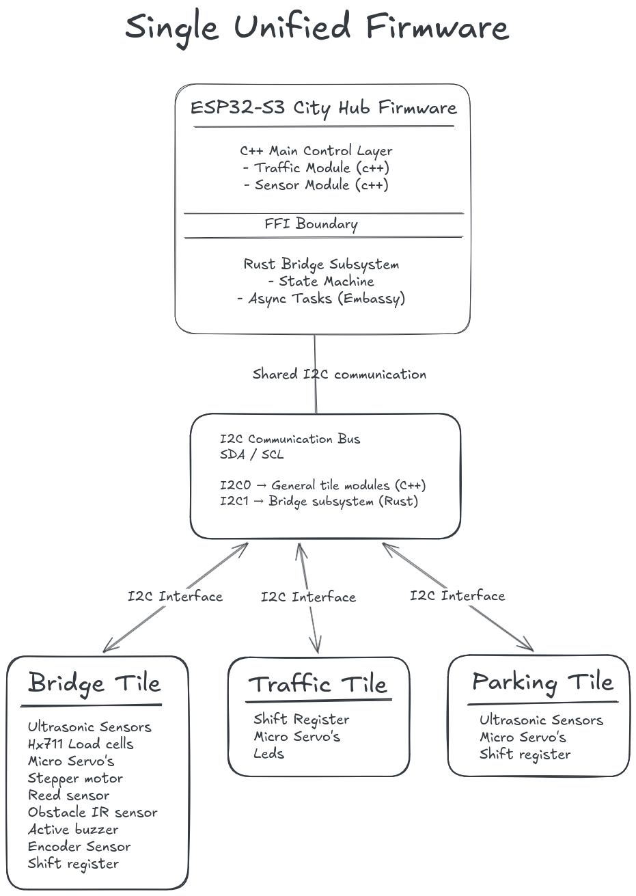

# Design: City Hub Bus & Integration Architecture

**Author:** Rocco Reus – Embedded & Robotics Engineer  
**Date:** April 4, 2026
**Version:** 1.0
**Learning Goal:** Design a modular, bus-based architecture for the ESP32-S3 City Hub

---

<!-- TOC -->
* [Design: City Hub Bus & Integration Architecture](#design-city-hub-bus--integration-architecture)
  * [1. Introduction](#1-introduction)
  * [2. Design Requirements](#2-design-requirements)
  * [3. Hardware Architecture (I2C Bus Design)](#3-hardware-architecture-i2c-bus-design)
    * [Figure 1 – I2C Bus Architecture](#figure-1--i2c-bus-architecture)
    * [Why this diagram?](#why-this-diagram)
    * [What is shown?](#what-is-shown)
    * [Explanation](#explanation)
  * [4. Address & Resource Mapping](#4-address--resource-mapping)
    * [Example Address Mapping](#example-address-mapping)
    * [Why this design?](#why-this-design)
  * [5. Software Architecture (C++ + Rust Integration)](#5-software-architecture-c--rust-integration)
    * [Figure 2 – Integration Strategies](#figure-2--integration-strategies)
    * [Why this diagram?](#why-this-diagram-1)
    * [What is shown?](#what-is-shown-1)
    * [Explanation](#explanation-1)
      * [Option A – Centralized Control](#option-a--centralized-control)
      * [Option B – Modular Subsystem (Chosen)](#option-b--modular-subsystem-chosen)
    * [Design Decision](#design-decision)
  * [6. System Architecture Overview](#6-system-architecture-overview)
    * [Figure 3 – City Hub System Overview](#figure-3--city-hub-system-overview)
    * [Why this diagram?](#why-this-diagram-2)
    * [What is shown?](#what-is-shown-2)
    * [Explanation](#explanation-2)
  * [7. Design Considerations](#7-design-considerations)
    * [Safety](#safety)
    * [Maintainability](#maintainability)
    * [Scalability](#scalability)
    * [System Reliability](#system-reliability)
  * [8. Conclusion](#8-conclusion)
<!-- TOC -->

---

## 1. Introduction

This design describes the architecture of the "City Hub" system, in which multiple independently developed tiles (such
as bridge, traffic, and sensor systems) are integrated into a single ESP32-S3 firmware.

The goal of this design is to:

- reduce GPIO usage through a shared communication bus
- ensure safe hardware interfacing (5V ↔ 3.3V)
- enable integration of Rust and C++ into one firmware
- support modular and scalable system growth

---

## 2. Design Requirements

The City Hub architecture must satisfy the following requirements:

- Support multiple tiles while minimizing GPIO usage
- Ensure safe communication between 5V and 3.3V components
- Enable integration of Rust and C++ into a single firmware
- Maintain compatibility with the “one firmware” requirement
- Allow scalable expansion of tiles and subsystems
- Provide clear separation of responsibilities between subsystems

These requirements guide all design decisions in this document.

---

## 3. Hardware Architecture (I2C Bus Design)

The hardware architecture is based on a shared I2C communication bus.

### Figure 1 – I2C Bus Architecture

  

**Figure 1:** Modular City Hub architecture using I2C as a shared communication bus.

---

### Why this diagram?

This diagram is used to visualize how multiple independent tiles can communicate with a single ESP32-S3 using minimal
wiring.

It demonstrates:

- how GPIO usage is reduced to two lines (SDA/SCL)
- how tiles are abstracted into independent modules
- how the system scales when more tiles are added

I2C is chosen because it is a widely adopted standard in embedded systems, supporting multi-device communication with
minimal pin usage.

---

### What is shown?

Figure 1 shows the hardware communication structure of the City Hub. The ESP32-S3 is positioned as the I2C master, while
the tiles are connected as independent I2C slaves. The diagram highlights that all tiles communicate through the same
SDA and SCL lines rather than through separate GPIO connections.

---

### Explanation

- The ESP32-S3 acts as the **central controller (I2C master)**
- Each tile acts as an **independent subsystem (I2C slave)**
- All tiles share the same SDA and SCL lines
- Internal tile logic is abstracted behind an I2C interface

To ensure safe operation:

- 5V components are connected through a **logic level shifter (LLS)**
- This prevents damage to the 3.3V ESP32-S3

---

## 4. Address & Resource Mapping

To avoid conflicts on the shared bus, a global addressing strategy is defined.

### Example Address Mapping

| Tile    | Address Range |
|---------|---------------|
| Bridge  | 0x10 – 0x1F   |
| Traffic | 0x20 – 0x2F   |
| Sensors | 0x30 – 0x3F   |

---

### Why this design?

This mapping ensures:

- no address collisions
- predictable integration between modules
- easier debugging and system expansion

---

## 5. Software Architecture (C++ + Rust Integration)

The firmware is designed as a **single unified system**, integrating both C++ and Rust.

### Figure 2 – Integration Strategies

  

**Figure 2:** Comparison of two integration strategies (Option A and Option B).

---

### Why this diagram?

This diagram is used to evaluate different ways of integrating Rust and C++ into a single firmware.

It helps to:

- compare architectural approaches
- visualize trade-offs between simplicity and modularity
- justify the final design decision

---

### What is shown?

Figure 2 shows two possible software integration strategies for combining Rust and C++ in one firmware. Option A
represents a centralized approach where C++ controls all modules directly, while Option B represents a modular subsystem
approach where the Rust bridge is separated more clearly from the rest of the firmware.

---

### Explanation

Two approaches are considered:

#### Option A – Centralized Control

- C++ manages all modules
- Rust acts as a helper via FFI
- simpler integration
- tightly coupled system

#### Option B – Modular Subsystem (Chosen)

- C++ acts as main controller
- Rust bridge runs as an independent subsystem
- communication via FFI
- supports dedicated hardware (e.g., I2C1)

---

### Design Decision

Option B is selected because:

- the bridge subsystem is complex and timing-sensitive
- Rust (Embassy) is suitable for async and state-machine logic
- separation improves maintainability and scalability

While Option A is simpler, it introduces tighter coupling between subsystems.  
Option B introduces more complexity but provides better modularity and flexibility.

---

## 6. System Architecture Overview

To provide a complete system-level perspective, a high-level overview is defined.

### Figure 3 – City Hub System Overview

  

**Figure 3:** High-level overview of the City Hub system architecture.

---

### Why this diagram?

This diagram is used to combine all design aspects into a single view.

It shows:

- how hardware, communication, and software interact
- how Rust and C++ coexist in one firmware
- how tiles are connected to the system

This makes it easier to understand the complete architecture instead of separate components.

---

### What is shown?

Figure 3 shows the complete City Hub system architecture. It combines the firmware structure, the I2C communication
layer, and the connected tiles into one overview. The diagram visualizes how a single ESP32-S3 firmware can coordinate
multiple tiles while separating the Rust bridge subsystem from the general C++ control layer.

---

### Explanation

- The ESP32-S3 runs a **single unified firmware**
- The firmware contains:
    - a C++ main control layer
    - a Rust bridge subsystem
- The **FFI boundary** separates the two language environments
- Communication with tiles is handled via a shared I2C bus
- Tiles operate as independent subsystems

This demonstrates how all components are integrated into one coherent system.

---

## 7. Design Considerations

### Safety

- Logic level shifting prevents hardware damage
- Reduced wiring lowers risk of failure

### Maintainability

- Modular tiles can be developed independently
- Subsystems are clearly separated

### Scalability

- New tiles can be added without redesign
- I2C supports multi-device expansion

### System Reliability

- Separation of subsystems reduces conflicts
- Dedicated buses improve stability

---

## 8. Conclusion

The proposed design provides a scalable and modular architecture for the City Hub system.

By combining:

- a shared I2C communication bus
- modular tile-based design
- hybrid Rust and C++ integration

the system can support multiple assets while maintaining safety, efficiency, and flexibility.

This design meets the defined requirements and provides a strong foundation for further system integration in future
sprints.