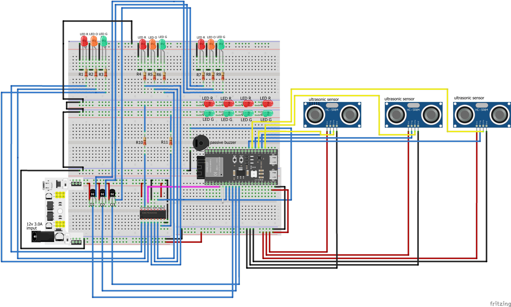

scematic of treffic light systen 

in the scematic you can see a symulation of my smart trafficlight design. It is intended for use by students, developers, and researchers who want to explore how intelligent traffic systems work. the ESP32 processes input from multiple HC-SR04 ultrasonic sensors and controls the LED traffic lights accordingly. With this system, users can study and test how traffic lights can respond dynamically to real-time conditions, making it useful for learning, experimentation, and developing smarter traffic solutions.

| Amount | Component |
|--------|-----------|
| 11 | Resistors 220Ω |
| 1 | Passive buzzer |
| 1 | MH breadboard power module supply module |
| 3 | HC-SR04 ultrasonic sensor |
| 1 | ESP32 |
| 7 | Green LED |
| 7 | red LED |
| 3 | orange LED |
|3|NPN Transistor 2N3904|
|1 |SN74HC595N|
