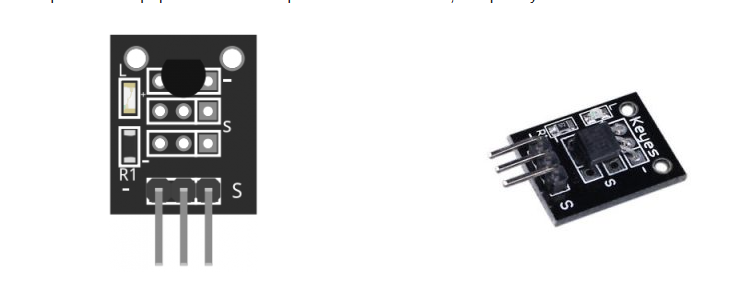
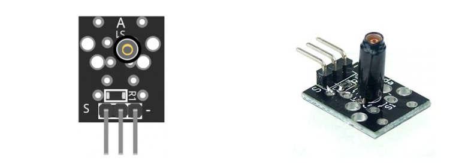

Below is al list of sensors you can use in your Smart City Sim.
You can get sensors (3 input sensors and 3 outputs) from the list for free if you need them. 

Study the list and guestimate what you might need in your Smart City Sim. 

Sensors Kit 35-in-1
For this semester we bought the following sensors that you can use in your individual project.

Sensor Kit

The sensors that are available for use are:

List of sensors
KY-001 Temperature sensor module
The KY-001 module is a small sensor used to measure ambient temperature in electronics projects. It is commonly used with platforms such as Arduino, Raspberry Pi, and ESP32. The module is based on the DS18B20 digital temperature sensor, which communicates through a 1-Wire digital interface, meaning only one data wire is needed for communication

KY-002 Vibration switch module

KY-003 Hall magnetic sensor module
KY-004 Key switch module
KY-005 Infrared emission sensor module
KY-006 Small passive buzzer module
KY-008 Laser sensor module
KY-009 3-color full-color LED SMD modules
KY-010 Optical broken module
KY-011 2-color LED module
KY-012 Active buzzer module
KY-013 Temperature sensor module
KY-015 Temperature and humidity sensor module
KY-016 3-color LED module
KY-017 Mercury open optical module
KY-018 Photo resistor module
KY-019 5V relay module
KY-020 Tilt switch module
KY-021 Mini magnetic reed modules
KY-022 Infrared sensor receiver module
KY-023 XY-axis joystick module
KY-024 Linear magnetic Hall sensors
KY-025 Reed module
KY-026 Flame sensor module
KY-027 Magic light cup module
KY-028 Temperature sensor module
KY-029 Yin Yi 2-color LED module 3MM
KY-031 Knock Sensor module
KY-032 Obstacle avoidance sensor module
KY-033 Hunt sensor module
KY-034 Automatic flashing colorful LED module
KY-035 Class Bihor magnetic sensor
KY-036 Metal touch sensor module
KY-037 Sensitive microphone sensor module
KY-038 Microphone sound sensor module
KY-039 Detect the heartbeat module
KY-040 Rotary encoder module
Click on the link for Arduino sample code and a connection diagram. You are allowed to use this code as a base for your project.
But because you need to integrate multiple sensors you ALSO need to understand what the code does,

You can use other more expensive and more accurate sensors, but you will have to source (and pay for) them yourself.

A good starting point to learn to read/write code for Arduino is:
https://docs.arduino.cc/built-in-examples/
And
https://docs.arduino.cc/learn/
Look at sections: Microcontrollers, Programming, Electronics, Communication, Hardware Design, Built In Libraries, Contributions.

Sometimes it is hard to distinguish between sensors. Take a look at the PDF attached to this announcement to get a better look at the pictures of the sensors.

Note: Some sensors might need a voltage level converter from 5V to 3.3V or the other way round to get them to work in combination with the ESP32. So search for the specs and read them before you get a sensor!

Gerald