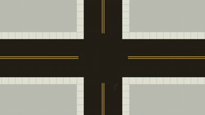
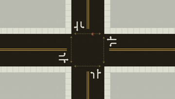
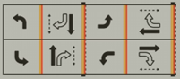

# Smart Traffic light.

## Introduction 

Why do we need smarter traffic lights? Traffic jams are a real problem in cities. It’s not only annoying for people and stressful, but it also increases air pollution, and poorly timed traffic lights can create dangerous situations. Traditional traffic lights follow a fixed schedule and struggle to adapt to real-time conditions.

What is a smart traffic light? A smart traffic light uses real-time data and makes decisions based on what its environment demands. Traditional lights work on fixed schedules, which can cause traffic jams or waste green lights when no one is waiting, stopping traffic unnecessarily. In contrast, a smart traffic light adapts to traffic demands by communicating with its environment. For example, if it detects a long line of traffic, it can give more green time, or if it senses a pedestrian, it can activate a timer for safe crossing.

## The main question:
What are smart traffic lights and what sensors do we need?

## Sub-questions:

### 1.	“normal” traffic lights.

### 2.  smart traffic light.

### 3.	sensors in smart traffic light.

#### 1.	“normal” traffic lights.

One of the most common irritations in traffic is congestion. Traffic jams are the reason people are late to work or experience stress. It’s not only annoying for people but also harmful to the environment. The longer cars are stuck in traffic, the longer their engines run and pollute the area, which is bad for everyone.

A simple and relatively low-cost solution for this problem is traffic lights, which help guide traffic. But how do they work exactly? In short, a traffic light is a set of three lights (red, green, and orange) facing each lane of an intersection. A green light means the lane can cross the road, orange means it will soon turn red and the lane should stop if possible, and red means vehicles cannot cross.

 

Image 1. In the image is a 4-lane traffic crossing visible without any markings of direction.

At every approach to an intersection, there are three possible directions: right, left, and straight. In traffic light systems, right turns and left turns are often grouped into one movement. Because of this, this intersection has 8 vehicle movements and 4 pedestrian movements (look at image 2).

Image 2. in the immage is a 4 lane traffic crossing vissible in this one I added the directions that vehicle can move in 

Image 2. In the image is a 4-lane traffic crossing. In this one, I added the directions that vehicles can move in.

These movements are grouped into phases of traffic signals.

If we look at the left-turn movements on opposite sides of the intersection, they can be grouped into one phase because both directions can turn left at the same time without conflicts. In image 3, you can see the four phases in a diagram.

Image 3. This is a ring-and-barrier diagram.   

Each phase consists of a green, orange (yellow), and red light, each with its own duration. First, the green light turns on for a certain amount of time. This is followed by the orange light for a short duration, and then the red light turns on, signaling the end of the phase.

The duration of each light is fixed and cannot be changed. This can cause situations where a light stays green even when there are no cars, while traffic builds up in another lane.

Smart traffic light 

Why do we need smarter traffic lights? 
Traffic jams are a real problem in cities. Its not only  nothing for People and can cause a lot of stress but it also increases air pollution and bad traffic lights can also cause Dangerous situations. Traditional traffic lights follow a fixed schedule and struggle to adapt to real time conditions.
What is a smart traffic light 

#### 2. smart traffic light.

Now we know how a traffic light works, it is time to look at how we can make a traffic light smart.

But what is “smart”? There is no single standard answer for this. The meaning of “smart” can vary depending on the context, the type of technology, and the perspective of the user.

Many times, an object is called smart when it is more than a normal object with one basic function. Smart objects can often sense their environment, collect data, and respond to what is happening around them. Smart objects use sensors that measure different things, depending on what the object is used for. These objects also contain a microcontroller and are often connected to the internet or a local network.

So, if I had to give a definition of a smart object, I would say:
“A smart object is an object that consists of a microcontroller and sensors that collect data and makes changes on its own based on the collected data and the wishes of the user.”

If we look at how we make a traffic light smart, we mainly look at ways to improve the flow of traffic. One way to do this is by detecting where traffic is. We can use sensors to determine if there are vehicles waiting in front of the traffic light, or if pedestrians are waiting to cross the road.

Smart traffic lights can also be used to help maintain the speed limit. For example, the traffic light system could change its behavior when a vehicle approaches while driving over the speed limit.

### 3.	sensors in smart traffic light.

first we are goin tolook in to 3 diffrent sensors that we can use to make our traffic light smart. then baste on my findings im going to make a desision on what sensors I am going to use fot my city

## sensors 
1. Inductive-loop
Induction loops are one of the most common methods used in traffic light systems today to detect the presence of a vehicle. They consist of wire loops embedded in the pavement that generate a magnetic field when an electric current flows through them. When a vehicle made of metal drives over or stops above the loop, it disturbs this magnetic field. This change is detected by a controller, which then sends a signal to the traffic light system indicating that a vehicle is present and waiting. Induction loops are reliable, widely used, and form an important part of many intelligent traffic control systems.

2. ultrasoon sensors
Ultrasonic sensors are not really commomly used in traffic light systems to detect the presence and distance of vehicles. They work by sending out high-frequency sound waves and measuring the time it takes for the echo to return after bouncing off an object, such as a car. Based on the time it takes for the sound to get back, the system can calculate how far away the object is. In traffic light systems, ultrasonic sensors are often mounted above or beside the road to monitor traffic flow without the need need to be instaled in the pavement. The data collected is sent to a microcontroller, which can then adjust the traffic lights in real time, for example by extending a green light when vehicles are detected or switching signals when no traffic is present. Ultrasonic sensors are relatively low-cost, easy to install, and well-suited for prototypes and smart traffic systems.

3. camera detection 
camera detection in smart traffic lights woeks by analyzing live video date in the form of imafes to detect vihicles and other travic to determen de conditions. The system looks at a set detection zones and recognizes when a vehicle enters the area. Based on this information, the traffic light controller can adjust signal timing or detect violations such as running a red light. Camera systems are more expensive but easier to install and maintain since they are placed above the road and dont need any big peperation to install. A major disadvantage of camera-based detection is that it is sensitive to environmental conditions such as rain, fog, darkness, and bright sunlight.

## Result

From this research, I learned how both traditional and smart traffic lights work and what the key differences are. Traditional traffic lights operate on fixed timings, which can lead to inefficient traffic flow and unnecessary waiting. Smart traffic lights improve this by using real-time data to adapt to traffic conditions.

I also explored different types of sensors, such as inductive loops, ultrasonic sensors, and camera detection. Each sensor has its own advantages and disadvantages in terms of cost, accuracy, and reliability.

Based on this, I now have a better understanding of how to design a smart traffic light system and which sensors are most suitable for my project.

## recomendation 
For this project, it is recommended to use ultrasonic sensors as the detection method to detect vehicles. Ultrasonic sensors are relatively low-cost, easy to install, and suitable for small-scale prototypes. They provide reliable distance measurements and are not affected by lighting conditions, which makes them practical for indoor and controlled environments.

While induction loops are more reliable in real-world traffic systems, they are difficult to implement in a prototype because they need to be installed in the road surface. Camera-based systems offer more advanced data and flexibility, but they are more expensive and sensitive to environmental conditions such as lighting and weather.

Therefore, ultrasonic sensors are the best choice for this project, as they offer a good balance between cost, simplicity, and functionality while still demonstrating the concept of a smart traffic light system.

 [my trafficlight design ](design.md)
 

### Sourses 
How Do Traffic Signals Work? (z.d.). YouTube. https://www.youtube.com/watch?v=DP62ogEZgkI

Rokonuzzaman, M. (2021). Title of the article. Journal Name.
https://www.sciencedirect.com/science/article/abs/pii/S014829632100847X

Editraffic. (2023). Inductive loop detector basics.
https://www.editraffic.com/wp-content/uploads/2023/07/Inductive-Loop-Detector-Basics.pdf

MaxBotix Inc. (z.d.). How ultrasonic sensors work.
https://maxbotix.com/blogs/blog/how-ultrasonic-sensors-work

Jackwin Safety. (z.d.). What are the cameras on top of traffic lights?
https://jackwinsafety.com/what-are-the-cameras-on-top-of-traffic-lights/

chatGPT