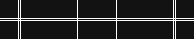

# City of Smart Heaven
Welcome to our learning group’s city! A friendly, solarpunk–futuristic smart city built on modular tiles.

**Scope:** 5 tiles of 30×30×0.36 cm plywood with laser‑engraved roads. We build physical features (3D prints, laser‑cut parts) and make them smart with sensors, lights, motors, and dashboards.

---

:material-play-circle: **Start here**

- [Vision](vision.md)
- [Tile map](layout/tile-map.md)
- [Tile standard](build-standards/tile-standard.md)
- [Roadmap](roadmap.md)
- [Process](process)

:material-ruler-square: **Build standards**
  Rules so everything fits together.

- [Electronics & wiring](build-standards/electronics-standard.md)
- [3D print & laser](build-standards/3d-printing.md)
- [Software standard](build-standards/software-standard.md)

:material-robot: **Smart systems**
  How the city “thinks”.

- [IoT network](systems/iot-network.md)
- [Energy grid](systems/energy.md)
- [Dashboard](systems/dashboard.md)

:material-hammer-wrench: **Features**
  Our working demo modules.

- [Traffic lights](features/traffic-lights.md)
- [Traffic lights2](features/traffic-light2.md)
- [Bridge](features/bridge.md)
- [Railway barrier](features/railway-barrier.md)
- [Parking](features/parking.md)

---

## Project at a glance

- **Platform:** 5× tiles of **30×30×0.36 cm plywood**
- **Style:** futuristic PC-hoofdstraat + solarpunk (green, friendly, renewable)
- **Build methods:** 3D print / laser cut + LEDs + sensors + actuators
- **Goal:** a stable demo where systems interact (not just props)

!!! note "City rules (always)"
- No politics or religion in visuals, text, or signage  
- Each tile contains **≥ 10% green space**  
- Build for **demo reliability**: safe motion, easy reset, labeled wiring  
- Hide wiring where possible (cable channels / underside routing)

---

## V1 demo scope

=== "Must-have features"
- Smart traffic lights  
- Smart bridge  
- Smart railway barrier  
- Smart parking lot

=== "Nice-to-have backlog"
- Smart street lighting (presence-based dimming)
- Air quality “green score” display
- Water level / flood indicator (bridge area)
- Smart waste bin (fill level)
- Micro solar + battery “energy status” indicator

---

## Tiles (ownership & focus — aka districts)

:material-map-marker: **T1 — Main street**

- Focus: flow + visuals + signage
- Features: traffic lights
- Owner: TBD

:material-parking: **T2 — District A**

- Focus: parking + sensors
- Features: smart parking
- Owner: TBD

:material-city: **T3 — District B**

- Focus: buildings + green space
- Features: TBD
- Owner: TBD

:material-bridge: **T4 — Bridge tile**

- Focus: moving mechanism + safety
- Features: smart bridge
- Owner: TBD

:material-train: **T5 — Rail tile**

- Focus: barrier + timing + signals
- Features: railway barrier
- Owner: TBD

---

## Team

:material-account: **Gavin Tjin-A-Soe**

- Role: TBD
- Focus: TBD

:material-account: **Hugo Janse**

- Role: TBD
- Focus: TBD

:material-account: **Denzel Purperhart**

- Role: TBD
- Focus: TBD

:material-account: **Bram van Son**

- Role: TBD
- Focus: TBD

:material-account: **Rocco Reus**

- Role: TBD
- Focus: TBD

---

## How we work (quick)
1. Pick a module in **Features**
2. Follow **Build standards** so it fits the city
3. Document decisions in **Logs → Decisions**
4. Keep demo-ready: include a **reset procedure** on every feature page

### Sprint rhythm
- Roles rotate each sprint; one team builds end-to-end
- Embedded/robotics work includes sensors, actuators, safety, reset procedure
- Backend work includes MQTT/HTTP integration, dashboard tiles, data storage

Use the template when you start something:

!!! tip "Use the feature template"
When you start a new module, copy: [Feature template](features/_template.md)

---

## Get involved
- Read the [contributing guide](contributing.md)
- Review our [Process](process/index.md)
- Claim a tile or feature on this page (set Owner to your name)
- Open a PR with your docs and photos/gifs of your prototype
