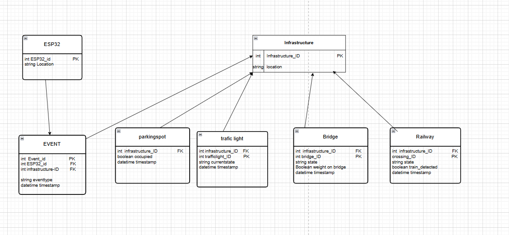

# Database design for Smart heaven project
**Made by:** Denzel Purperhart
**Date:** April 2, 2026
**Subject:** Design document for the backend for smart heaven.

<!-- TOC -->
* [Database design for Smart heaven project](#database-design-for-smart-heaven-project)
  * [1. Introduction](#1-introduction)
  * [2. Stakeholders and System Context](#2-stakeholders-and-system-context)
  * [3. Design Methodology](#3-design-methodology)
  * [4. System Data Requirements](#4-system-data-requirements)
  * [5. Entity Relationship Diagram Overview](#5-entity-relationship-diagram-overview)
  * [6. Entity Descriptions](#6-entity-descriptions)
  * [7. Relationships Between Entities](#7-relationships-between-entities)
  * [8. Conclusion](#8-conclusion)

# 1. Introduction

Explain:

This document describes the initial backend database design for the Smart Heaven system. The purpose of this document is to present and explain the Entity Relationship Diagram (ERD) that has been created for the backend architecture. The ERD defines how infrastructure data from multiple ESP32 smart tiles will be structured and stored in the database.

The goal of this design is to createdatabase structure that can be implemented in a later development phase of the backend system. The database will store infrastructure-related data such as traffic light status, bridge activity, timestamps.

Based on previous research, PostgreSQL was selected as the most suitable relational database management system (RDBMS) for this project. PostgreSQL supports structured data storage, reliable multi-device communication, and scalability for future expansion of the Smart Heaven infrastructure monitoring platform.

The backend database will function as the central storage component of the system and will support communication between ESP32 devices and the monitoring dashboard. The ERD presented in this document defines the entities, attributes, and relationships required to ensure reliable storage and retrieval of infrastructure monitoring data.

# 2. Stakeholders and System Context

This document is intended for the backend developers who are responsible for designing and implementing the backend system of the Smart Heaven project. The database structure described in this document supports the storage and processing of infrastructure data collected from multiple ESP32 smart tiles deployed throughout the city.

The main goal of the system is to allow city operators to monitor infrastructure in real time and manually control components such as traffic lights and bridges when necessary. For this reason, all infrastructure events must be stored in the database together with timestamps and device identifiers.

In the final system, a dashboard will be used by the operator to view infrastructure status and send control commands to devices in the city. The dashboard must therefore support both data visualization and manual interaction with infrastructure components. To support this functionality, the backend database must store historical infrastructure data and log all changes made by the operator.

The requirements of the dashboard and the operator were used as input for designing the ERD structure presented in this document.

# 3. Design Methodology

The database structure was designed using relational database modelling principles to ensure that infrastructure data from multiple ESP32 devices can be stored in a structured and scalable way. An Entity Relationship Diagram (ERD) was created using attributes, and relationships within the system.

During the design process, normalization techniques were applied to reduce data redundancy and improve data integrity. The database schema follows the principles of the first and second normal forms (1NF and 2NF), ensuring that each table stores only relevant information and that relationships between tables are clearly defined through primary and foreign keys.

Primary keys were used to uniquely identify each record in the database, while foreign keys were implemented to create relationships between infrastructure devices, events, and control commands. This allows the system to store infrastructure updates from multiple smart tiles in a consistent and reliable structure.

The database design was also created to support compatibility with a REST-based backend architecture. This ensures that the backend server can efficiently receive infrastructure status updates from ESP32 devices and provide data to the monitoring dashboard through API endpoints.

These modelling methods improve the maintainability, scalability, and reliability of the backend system and follow standard practices used in professional database design.

# 4. System Data Requirements

The backend database must store several types of infrastructure data collected from ESP32 smart tiles and the dashboard system. Each type of data is necessary to support monitoring, control, and analysis of city infrastructure.

The database stores the device ID of each smart tile so the system can identify which ESP32 device sends the data. This makes it possible to track infrastructure activity per location or device.

The system for example also stores the traffic light status or bridge state to monitor the current condition of infrastructure components. This allows operators to see whether a traffic light is green or red or whether a bridge is open or closed.

Timestamps are stored together with each event so the system can analyse when infrastructure changes happen. This makes it possible to review historical activity or detect unusual behaviour over time.

The database stores control commands that are sent from the dashboard to infrastructure devices. This ensures that manual changes made by operators are logged and can be traced later if needed.

Finally, the system stores user actions to record which operator made changes to infrastructure components. This improves security and accountability within the monitoring system.

Together, these data types ensure that the backend system can support reliable monitoring, control, and long-term analysis of smart city infrastructure.

# 5. Entity Relationship Diagram Overview

(Figure 1: Entity Relationship Diagram of the Smart City Backend Database)

# 6. Entity Descriptions

The Entity Relationship Diagram (ERD) represents the structure of the backend database used in the Smart Heaven infrastructure monitoring system. The diagram shows how data collected from ESP32 devices is stored and how different infrastructure components are connected within the database.

The central entity in the diagram is the Infrastructure table. This table stores general information about infrastructure components in the city, such as their unique identifier and location. Each infrastructure object represents a smart system element, for example a parking space, traffic light, bridge, or railway crossing.

The ESP32 entity represents the smart tile devices that collect and send infrastructure data to the backend system. Each ESP32 device has its own unique identifier and location so the system can determine where the data originates.

The Event entity stores status updates generated by ESP32 devices. Each event contains a timestamp and an event type and is linked to both the ESP32 device and the infrastructure component. This allows the system to track when changes occur in the city infrastructure.

The ParkingSpot entity stores whether a parking space is occupied and when the status was recorded. This allows operators to monitor parking availability in real time 

The TrafficLight entity stores the current state of traffic lights together with timestamps. This makes it possible to analyse traffic flow behaviour and detect timing changes 🚦

The Bridge entity stores whether the bridge is open or closed and whether weight is detected on the bridge. This supports monitoring of bridge safety and usage 

The Railway entity stores the crossing state and whether a train is detected. This helps control traffic safety at railway crossings 

# 7. Relationships Between Entities

Each of these infrastructure tables is connected to the Infrastructure entity using a foreign key relationship. This ensures that every infrastructure component belongs to one central infrastructure record while still allowing detailed subsystem-specific data to be stored separately.

The relationships between ESP32 devices, infrastructure components, and events make it possible to store structured monitoring data, track historical infrastructure behaviour, and support real-time dashboard interaction for operators.

This relational structure improves scalability, reliability, and maintainability of the backend system and supports future expansion of the Smart Heaven smart city platform.

# 8. Conclusion
This document presented the database design for the Smart Heaven backend system using an Entity Relationship Diagram (ERD). The ERD defines how infrastructure data from multiple ESP32 devices is structured and stored in a PostgreSQL database. The design supports monitoring and control of smart city components such as parking systems, traffic lights, bridges, and railway crossings.

The database structure ensures that infrastructure events are stored together with device identifiers and timestamps. This makes it possible to track changes over time and supports real-time monitoring through a dashboard interface. In addition, manual control actions performed by operators can be logged in the system, which improves traceability and reliability of infrastructure management.

The relational structure of the database improves scalability because new infrastructure components or additional smart tiles can be added without major changes to the existing schema. The use of primary keys and foreign keys ensures data integrity and creates clear relationships between devices, infrastructure objects, and events.

Security and accountability are supported by storing user actions and control commands in the database. This allows operators to safely interact with infrastructure systems while maintaining a history of all changes made through the dashboard.

Overall, the ERD provides a structured and maintainable foundation for the Smart Heaven backend system and supports future expansion of the smart city monitoring platform.