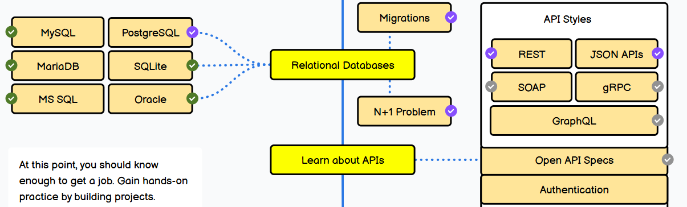

# Relational database
**Made by:** Denzel Purperhart
**Date:** April 2, 2026
**Subject:** Research document for the backend for smart heaven.

<!-- TOC -->
* [Relational Database Selection for the Smart City Tile Backend](#relational-database-selection-for-the-smart-city-tile-backend)
  * [1. Introduction](#1-introduction)
    * [1.1 Target Audience and Stakeholder Context](#11-target-audience-and-stakeholder-context)
    * [1.2 Problem Statement](#12-problem-statement)
    * [1.3 Central Research Question](#13-central-research-question)
  * [2. Relational Database Fundamentals](#2-relational-database-fundamentals)
    * [2.1 What is a Relational Database](#21-what-is-a-relational-database)
    * [2.2 Example Schema: Traffic Light Infrastructure Tables](#22-example-schema-traffic-light-infrastructure-tables)
    * [2.3 Relational Database Management Systems (RDBMS)](#23-relational-database-management-systems-rdbms)
    * [2.4 Advantages and Disadvantages of Relational Databases](#24-advantages-and-disadvantages-of-relational-databases)
  * [3. Functional Requirements of the System](#3-functional-requirements-of-the-system)
  * [4. Non-Functional Requirements](#4-non-functional-requirements)
  * [5. Project Constraints](#5-project-constraints)
  * [6. Comparison of Relational Databases](#6-comparison-of-relational-databases)
    * [6.1 PostgreSQL](#61-postgresql)
    * [6.2 MySQL](#62-mysql)
    * [6.3 MariaDB](#63-mariadb)
    * [6.4 Microsoft SQL Server](#64-microsoft-sql-server)
    * [6.5 SQLite](#65-sqlite)
    * [6.6 Comparison Based on Functional Requirements](#66-comparison-based-on-functional-requirements)
    * [6.7 Comparison Based on Non-Functional Requirements](#67-comparison-based-on-non-functional-requirements)
  * [7. Conclusion](#7-conclusion)
  * [Sources](#sources)
<!-- TOC -->

# 1. Introduction
This research is intended to determine which type of database is most suitable for this project. Different relational databases will be analysed in order to reach a conclusion about which relational database fits the project best.

The selection will be based on both functional and non-functional requirements, such as what data needs to be stored, how the data will be logged, and how fast the database needs to be. In addition, the requirements of the mayor will also be considered, for example whether the database needs to be connected to a front-end application.

(image 1: relational databse options)

## 1.1 Target Audience and Stakeholder Context

This research is written for (backend) developers and stakeholders who are involved in working on the smart heaven project. The backend system is intended to collect infrastructure data from multiple ESP32 devices and store this information in a backend database for monitoring and control through a dashboard interface.

 Because the system may be deployed in a public environment, the selected database must be reliable, secure, scalable, and cost-efficient. But more on this requirments in a later chapter.

## 1.2 Problem statement

The smart city tile system collects infrastructure data from multiple ESP32 devices that are distributed across different locations in the city. These devices continuously send structured data such as traffic light status, bridge activity, timestamps, and device identifiers to a backend system.

To store this information correctly, a suitable relational database management system must be selected. The database must support multiple simultaneous device connections, real-time monitoring through a dashboard, and secure storage of infrastructure data. If the selected database does not meet these requirements, the system may experience performance issues, unreliable logging, or limited scalability when more smart tiles are added.

Therefore, it is necessary to analyse which relational database management system best supports the technical requirements of this smart city infrastructure monitoring platform.

## 1.3 Central Research Question

The central research question of is:

Which relational database management system is most suitable for storing infrastructure monitoring data from multiple ESP32 smart tiles while supporting scalability, reliability, security, and real-time dashboard integration?

## 2.1 What is a relational database?

A relational database is a collection of information that organizes data in predefined relationships where data is stored in one or more tables (or "relations") of columns and rows, making it easy to see and understand how different data structures relate to each other. Relationships are a logical connection between different tables, established on the basis of interaction among these tables. (What is a Relational Database?, n.d.)

Examples of relational databases include PostgreSQL, MySQL, MariaDB, Microsoft SQL Server, Oracle, and SQLite. these type of databases will be discussed in later chapter. Relational databases retrieve information using SQL queries. SQL (Structured Query Language) is used to store, retrieve, update, and manage data in relational database systems.

Examples of SQL statements and functions that are commonly used in queries include:

- SELECT – retrieves data from a table
- INSERT – adds new data to a table
- UPDATE – modifies existing data
- DELETE – removes data from a table
- WHERE – filters results based on conditions
- JOIN – combines data from multiple tables
- ORDER BY – sorts query results
- GROUP BY – groups rows with similar values
- COUNT() – counts the number of records
- MAX() / MIN() – finds highest or lowest values
- AVG() – calculates the average value

Data in relational databases can be stored, retrieved, and modified. These functions are performed through an RDBMS (Relational Database Management System).

###  2.2 How does such table look like?

Think of the relational database as a collection of spreadsheet files that help businesses organize, manage, and relate data. In the relational database model, each “spreadsheet” is a table that stores information, represented as columns (attributes) and rows (records or tuples). 

Attributes (columns) specify a data type, and each record (or row) contains the value of that specific data type. All tables in a relational database have an attribute known as the primary key, which is a unique identifier of a row, and each row can be used to create a relationship between different tables using a foreign key—a reference to a primary key of another existing table.
Say we have a trafic light system:

The TrafficLight table contains data about each traffic light device:

TrafficLight ID (primary key)
Location
Current color
Next color

In the TrafficLight table, the TrafficLight ID is the primary key that uniquely identifies each traffic light in the relational database. No other traffic light has the same ID.

The TrafficLightEvent table contains status change information about traffic lights:

Event ID (primary key)
TrafficLight ID (foreign key)
Current color
Next color
Change time

Here, the primary key that identifies a specific event is the Event ID. The system connects a traffic light to its status change events by using a foreign key that links the TrafficLight ID from the TrafficLight table.

The two tables are now related based on the shared TrafficLight ID, which means you can query both tables together to monitor infrastructure behavior. For example, a city operator could generate a report showing when a specific traffic light changed color during the day or detect unusual timing patterns in traffic light activity.

This structure makes it possible to store and analyse infrastructure data from multiple smart tiles with ESP32 devices in a structured and reliable way. Because the relationships between the tables are predefined, the system can retrieve information efficiently using SQL queries. (What Is A Relational Database (RDBMS)? | Google Cloud, z.d.)

| ID | current state | current_color | next color | Time |
| :--- | :--- | :--- | :--- | :--- |
| 1 | TL_01 | green | Red | 14:30|
| 2 | TL_02 | green | Red | 14:30 |
| 3 | TL_03 | Red | Green | 14:30 |

## 2.3  Relational database management system (RDBMS) 
Relatioan datavase managemant systems (RDBMS) is a program used to create, update, and manage relational databases. Some of the most well-known RDBMSs include MySQL, PostgreSQL, MariaDB, Microsoft SQL Server, and Oracle Database.(What Is A Relational Database (RDBMS)? | Google Cloud, z.d.)
    
## 2.4 Advantages and disadvantages of relational databases
Relational databases are flexible because tables and relationships can be added, updated, or removed without changing the whole system. They support ACID n(Atomicity, Consistency, Isolation, Durability) properties, which ensure data remains correct even if errors occur. SQL makes it easy to perform complex queries, and multiple users can access the database at the same time. They also include role-based security to control access and use normalization to reduce duplicate data and improve data integrity. (What Is A Relational Database (RDBMS)? | Google Cloud, z.d.)

However, relational databases also have some limitations. They use a fixed schema, which makes changes difficult when requirements evolve. Performance can decrease with very large datasets or complex joins, and scaling across multiple servers can be challenging. Designing and maintaining relational databases can also be complex and costly, especially for large systems. Furthermore, they are less suitable for unstructured data and real-time analytics, and concurrency control may slow performance when many users access the database at the same time. (GeeksforGeeks, 2025)

## 3. funcional requirment

Functional requirements describe what the system must do. 

The system consists of smart tiles with an ESP32 microcontroller that collect and send city infrastructure data (for example traffic lights and bridges) to a backend database. The system must also allow operators to manually control infrastructure using a dashboard interface.

The functional requirements are:
1. Data collection

The ESP32 must collect status data from infrastructure components such as traffic lights and bridges.
Each tile must send sensor data to the backend system.
The system must log timestamps together with each event.

2. Data storage

The backend must store all received infrastructure data in a structured database.
Historical data must remain available for later analysis.

3. Real-time monitoring

The system must display current infrastructure status on a dashboard.
Operators must be able to see which traffic lights are active.
Operators must be able to see whether a bridge is open or closed.

4. Manual control

Authorized users must be able to change infrastructure states manually via the dashboard.
The system must send control commands from the dashboard to the ESP32 devices.
Changes must be logged in the database.

5. Device identification

Each smart tile must have a unique ID.
The backend must recognize which tile sends which data.

6. Communication

ESP32 devices must communicate with the backend through Wi-Fi or another network connection.
The backend must confirm receipt of data packets.
## 4. Non-Functional Requirements

Non-functional requirements describe how well the system must perform.(Masters, 2020) 

These requirements are important for selecting the correct database and backend architecture.

1. Performance

The system must process incoming data with minimal delay.
Status updates should appear on the dashboard in near real time.

2. Scalability

The system must support many tiles distributed across the city.
The database must handle large volumes of incoming sensor data.

3. Reliability

The system must continue operating even if some tiles temporarily disconnect.
Data loss must be minimized during transmission.

4. Security

Only authorized users may control infrastructure components.
Communication between ESP32 devices and backend must be secured.
Stored infrastructure data must be protected from unauthorized access.

5. Compatibility

The backend must support integration with a web dashboard.
The system must support communication with embedded ESP32 hardware.

6. cost

the system must be free to use.
##  5. Project Constraints

There are also some technical limits that influence the system design.
The system uses ESP32 microcontrollers, so the solution must support embedded devices. The tiles communicate wirelessly with the backend system. The system must support real-time monitoring through a dashboard. It must also store structured data such as device IDs, timestamps, and infrastructure status changes.

These constraints help decide which database is the best choice for the project.

# 6. Comparison of Relational Databases

In this chapter, several relational databases are described and compared. The goal is to decide which relational database is the most suitable for the smart city tile system with ESP32 devices and a monitoring dashboard.

## 6.1 PostgreSQL

PostgreSQL is an open-source relational database system that is known for reliability, scalability, and strong support for complex queries. It supports large datasets and multiple users at the same time. PostgreSQL also provides strong data integrity through ACID transactions and advanced security features.

Because this project needs to store infrastructure data from many ESP32 tiles and support dashboard communication, PostgreSQL is a strong candidate. It is especially useful when working with structured data such as timestamps, device IDs, and status updates. (PostgreSQL: About, z.d.)

## 6.2 MySQL

MySQL is widely used in web applications and is known for good performance and easy integration with backend systems.

MySQL is suitable for systems that require fast data processing and stable performance. It also supports multiple users and structured datasets. However, compared to PostgreSQL, it has fewer advanced features for complex queries and large-scale analytics.

For this project, MySQL could be a good solution because it works well with dashboards and real-time applications.(Jackson, 2025)

##  6.3 MariaDB

MariaDB is a relational database that was developed as an improved version of MySQL. It is also open source and offers good performance and security. MariaDB is compatible with MySQL, which makes migration between the two systems easier.

MariaDB is suitable for applications that require fast data processing and reliability. It can also handle multiple device connections at the same time, which is useful for ESP32-based systems.(MariaDB.org, 2019)

##  6.4 Microsoft SQL Server

Microsoft SQL Server is a database system developed by Microsoft. It provides strong performance, security, and integration with enterprise software systems.

Although SQL Server is powerful, it requires licenses and is mainly used in large business environments. For smaller smart city projects or embedded systems, it may be less practical than open-source alternatives. (MashaMSFT, z.d.)

##  6.5 SQLite

SQLite is a lightweight relational database that runs locally inside applications. It does not require a server and is easy to set up.

However, SQLite is designed for small systems with limited users. It does not support many simultaneous connections, which makes it less suitable for projects with multiple ESP32 devices sending data at the same time. (About SQLite, z.d.)

## 6.6 Comparison Based on Functional and Non-Functional Requirements

To select the most suitable relational database for the smart city tile system, the databases were compared using the functional and non-functional requirements defined earlier.

## 6.7 Functional Requirements Comparison

The database must store structured infrastructure data, support real-time monitoring, allow manual control logging, and handle multiple ESP32 devices sending data simultaneously.

PostgreSQL supports structured sensor data storage, strong multi-user access, and reliable logging with timestamps and device IDs. It also works well with dashboard integrations.

MySQL supports structured data storage and real-time monitoring but has fewer advanced features for handling complex infrastructure data compared to PostgreSQL.

MariaDB performs similarly to MySQL and supports multiple device connections, but it provides fewer advanced analytical capabilities.

Microsoft SQL Server supports all functional requirements but requires a license, which conflicts with the project constraint that the system must be free to use.

SQLite does not support many simultaneous connections and is therefore not suitable for multiple ESP32 devices sending data at the same time.

## 6.8 Non-Functional Requirements Comparison

The system must be scalable, reliable, secure, compatible with ESP32 devices, and free to use.

PostgreSQL provides strong scalability and reliability. It supports multiple simultaneous connections and includes advanced security features. It is also open source, which meets the cost requirement.

MySQL offers good performance and compatibility with web dashboards, but it is slightly less scalable than PostgreSQL for complex systems.

MariaDB provides good performance and open-source availability, making it suitable for medium-scale infrastructure monitoring systems.

Microsoft SQL Server offers high performance and security but does not meet the cost requirement because it requires licensing.

SQLite is lightweight and free but does not meet scalability and multi-user requirements.

# 7. backend deoployment

The backend system is deployed using Docker containers to ensure portability, scalability, and consistent configuration across development environments. Docker allows the PostgreSQL database and backend API server to run in isolated containers instead of directly on a local machine. This makes it easier for developers to work on the system without installation conflicts and ensures that the backend behaves the same on different computers.

In the Smart Heaven system, Docker is used to run the RDBMS as a dedicated container that stores infrastructure data from multiple ESP32 devices. The backend API server communicates with this database container and processes incoming sensor updates from smart tiles. The dashboard application can then retrieve infrastructure status information through the backend API.

Using Docker also improves maintainability of the system because containers can be restarted, updated, or replaced without affecting the host system. This makes the backend architecture easier to deploy later on a server environment when the system is scaled to support more smart tiles across the city.

# 7.1 Container Architecture Overview

The backend deployment consists of multiple containers that work together as part of the infrastructure monitoring system.

The  container stores infrastructure data such as traffic light status, bridge activity, railway crossing states, parking availability, timestamps, and control commands. The backend API container receives data from ESP32 devices and writes this information to the database. The dashboard communicates with the backend API container to retrieve real-time infrastructure updates.

This container-based architecture separates system components and improves reliability and scalability of the backend platform.

ESP32 devices → Backend API container →  RDBMS container → Dashboard interface

# Conclusion

Based on the functional requirements, the selected database must support structured storage of infrastructure data from multiple ESP32 devices, real-time monitoring through a dashboard, logging of manual control actions, and reliable identification of individual smart tiles using device IDs and timestamps. PostgreSQL supports these requirements through strong multi-user access, reliable transaction handling, and efficient storage of structured data.

Based on the non-functional requirements, the database must provide high performance for near real-time updates, scalability for future deployment of additional smart tiles across the city, secure access control for infrastructure operators, compatibility with embedded ESP32 communication, and open-source availability to meet cost constraints. PostgreSQL satisfies these requirements by supporting concurrent device connections, ACID-compliant transactions for data integrity, advanced security mechanisms, and scalable long-term storage of infrastructure monitoring data.

In comparison with MySQL and MariaDB, PostgreSQL offers stronger support for complex queries and long-term scalability. Microsoft SQL Server does not meet the project requirement of being free to use, and SQLite does not support simultaneous connections from multiple ESP32 devices.

Therefore, PostgreSQL is the most suitable relational database management system for the smart city infrastructure monitoring backend.

#  sources
1. Wat is een relationele database? (z.d.). https://www.oracle.com/nl/database/what-is-a-relational-database/

2. GeeksforGeeks. (2025, 23 juli). RDBMS Benefits and Limitations. GeeksforGeeks. http://geeksforgeeks.org/dbms/rdbms-benefits-and-limitations/

3. Staff, R. (2024, 12 juli). What are Functional Requirements? Requirements.com. https://requirements.com/Content/What-is/what-are-functional-requirements

4. Masters, M. (2020, 20 september). What are Non Functional Requirements? Requirements.com. https://requirements.com/Content/What-is/what-are-non-functional-requirements

5. PostgreSQL: about. (z.d.). The PostgreSQL Global Development Group. https://www.postgresql.org/about/

6. Jackson, B. (2025, 1 oktober). Wat is MySQL? Een beginnersvriendelijke uitleg. Kinsta®. https://kinsta.com/nl/blog/wat-is-mysql/

7. MariaDB.org. (2019, 13 november). MariaDB Foundation - MariaDB.org. https://mariadb.org/

8. MashaMSFT. (z.d.). SQL Server Technical Documentation - SQL Server. Microsoft Learn. https://learn.microsoft.com/en-us/sql/sql-server/?view=sql-server-ver17

9. About SQLite. (z.d.). https://www.sqlite.org/about.html

10. What is a relational database (RDBMS)? | Google Cloud. (z.d.). Google Cloud. https://cloud.google.com/learn/what-is-a-relational-database